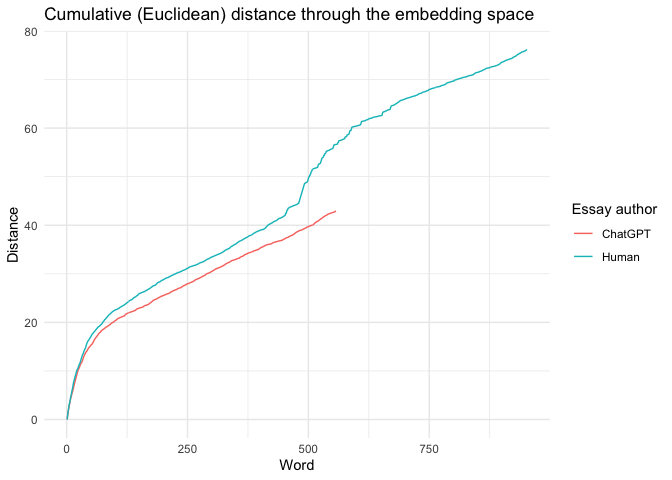
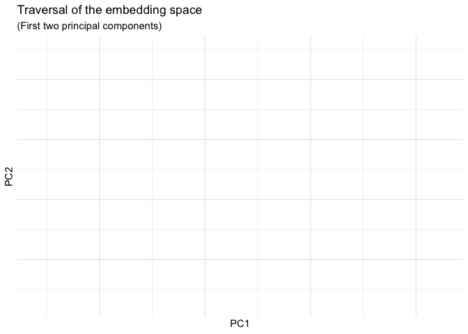

Exploring embedding space traversal
================
Colin Fraser
2024-09-04

Note `{openaiwrapper}` is written by me and not on CRAN. It’s
installable with
`devtools::install_github("colin-fraser/wrapify/examples/openai/")`

``` r
library(openaiwrapper)
library(readr)
library(stringr)
library(purrr)
library(tidyverse)
```

    ## ── Attaching packages ─────────────────────────────────────── tidyverse 1.3.2 ──
    ## ✔ ggplot2 3.5.1     ✔ dplyr   1.1.4
    ## ✔ tibble  3.2.1     ✔ forcats 0.5.2
    ## ✔ tidyr   1.3.0

    ## Warning: package 'ggplot2' was built under R version 4.2.3

    ## Warning: package 'dplyr' was built under R version 4.2.3

    ## ── Conflicts ────────────────────────────────────────── tidyverse_conflicts() ──
    ## ✖ dplyr::filter() masks stats::filter()
    ## ✖ dplyr::lag()    masks stats::lag()

``` r
library(gganimate)

parse_words <- function(x, sep = "\\s+") {
  str_split_1(x, sep)
}

embedding_resp_to_vector <- function(emb) {
  emb$data |> 
    map("embedding") |> 
    map(unlist)
}

get_embedding_vecs <- function(x, dimensions = NULL, model = c("text-embedding-3-small", "text-embedding-3-large"),
                              post_process = embedding_resp_to_vector) {
  model <- match.arg(model)
  get_embedding(x, dimensions = dimensions, model = model) |>
    post_process()
}

get_embedding_sequence <- function(x, start=1, stop=20, dimensions=8, model = "text-embedding-3-large",
                                   .verbose = FALSE) {
  # Gets a sequence of embeddings by iteratively chopping the input. E.g.
  # get_embedding_sequence("hello there") returns a list with the embeddings for
  # "hello" and "hello there".
  out <- vector(mode = "list", length = stop - start + 1)
  words <- parse_words(x)[start:stop]
  chunks <- map_chr(start:stop, \(x) paste(words[start:x], collapse = " "))
  get_embedding_vecs(chunks, model = model, dimensions = dimensions)
}

get_embedding_sequence_for_file <- function(file, start, stop, dimensions=8, model = model,
                                            .verbose = FALSE) {
  text <- read_file(file)
  get_embedding_sequence(text, start, stop, dimensions=dimensions, model=model, .verbose=.verbose)
}

diffs <- function(embedding_sequence, p = 2) {
  # computes the distances between each embedding in the embedding sequence
  map_dbl(seq_len(length(embedding_sequence)-1), \(x) {
    sum((embedding_sequence[[x+1]] - embedding_sequence[[x]])^p)^(1/p)
  })
}

convert_to_df <- function(embedding_sequence) {
  do.call("rbind", embedding_sequence) |>
    as_tibble() |>
    mutate(t = row_number())
}

build_embedding_sequence_df <- function(file, start=1, stop=20, p=2, text = NULL, dimensions=8, 
                                        name = NA, model = "text-embedding-3-small", .verbose=TRUE) {
  if (is.null(file)) {
    if (is.null(text)) {
      stop("text and file can't both be null")
    }
    file <- tempfile()
    write_file(text, file)
  }
  text <- read_file(file)
  all_words <- parse_words(text)
  stop <- min(stop, length(all_words))
  words <- all_words[start:stop]
  embedding_sequence <- get_embedding_sequence_for_file(file, start, stop, dimensions=dimensions,
                                                        model = model, .verbose = TRUE)
  embedding_df <- convert_to_df(embedding_sequence)
  embedding_df$word <- words
  embedding_df$delta <- c(NA, diffs(embedding_sequence, p))
  embedding_df$name <- name
  embedding_df
}

if (file.exists("data/essays_with_embeddings.csv")) {
  essays <- read_csv("data/essays_with_embeddings.csv")
} else {
  real_essay_seq <- build_embedding_sequence_df(file="data/happiness_success_person.txt", 1, Inf, 
                                                name = 'Human', dimensions = NULL, 
                                                model = "text-embedding-3-large")
  chatgpt_essay_seq <- build_embedding_sequence_df(file="data/happiness_success_chatgpt.txt", 1, Inf, 
                                                   name = 'ChatGPT', dimensions = NULL, 
                                                   model = "text-embedding-3-large")
  
  essays <- bind_rows(real_essay_seq, chatgpt_essay_seq) |> 
    arrange(name, t) |> 
    group_by(name) |> 
    mutate(cumulative_distance = cumsum(coalesce(delta, 0))) |> 
    ungroup()
  
  pcs <- essays |>
    select(starts_with("V")) |>
    prcomp(rank=100, scale = TRUE)
  
  essays <- pcs$x[,1:5] |>
    as_tibble() |>
    bind_cols(essays)
  
  write_csv(essays, "data/essays_with_embeddings.csv")
}
```

    ## Rows: 1509 Columns: 3082
    ## ── Column specification ────────────────────────────────────────────────────────
    ## Delimiter: ","
    ## chr    (2): word, name
    ## dbl (3080): PC1, PC2, PC3, PC4, PC5, V1, V2, V3, V4, V5, V6, V7, V8, V9, V10...
    ## 
    ## ℹ Use `spec()` to retrieve the full column specification for this data.
    ## ℹ Specify the column types or set `show_col_types = FALSE` to quiet this message.

``` r
essays |>
  ggplot(aes(x = t, y = cumulative_distance, color = name, label = word)) +
  geom_line() +
  labs(title = "Cumulative (Euclidean) distance through the embedding space",
       x = "Word", y = "Distance", color = "Essay author") +
  theme_minimal()
```

<!-- -->

``` r
essays |> 
  ggplot(aes(x = PC1, y=PC2, color = name)) +
  geom_path() +
  transition_reveal(t) +
  labs(title = 'Traversal of the embedding space', subtitle = "(First two principal components)", color = "Text by") +
  theme_minimal()
```

    ## `geom_path()`: Each group consists of only one observation.
    ## ℹ Do you need to adjust the group aesthetic?
    ## `geom_path()`: Each group consists of only one observation.
    ## ℹ Do you need to adjust the group aesthetic?

<!-- -->

``` r
viz <- essays |> 
  mutate(color = scales::cscale(coalesce(essays$delta, 0), 
                                scales::pal_gradient_n(c('grey90', 'red')), 
                                trans = scales::transform_log()),
         fw = abs(1000 * delta / max(abs(delta), na.rm=TRUE))) |> 
  transmute(name, t, word, delta = coalesce(delta, 0), color,
            tagged_word = str_glue('<span style="color:{color};font-weight:{fw};">{word}</span>')) |> 
  filter(!is.na(word)) |> 
  group_by(name) |> 
  summarise(html=paste0(tagged_word, collapse=" ")) |> 
  mutate(html = str_c("<h3>", name, " essay</h3>", html)) |> 
  pull(html)
```

Below are the essays with each word colored and weighted by the distance
that it traverses in the embedding space.

``` r
htmltools::HTML(viz[1])
```

<h3>ChatGPT essay</h3><span style="color:NA;font-weight:NA;">Success</span> <span style="color:#FF1105;font-weight:940.238349146001;">and</span> <span style="color:#FF2D15;font-weight:763.07202861246;">happiness</span> <span style="color:#FF3018;font-weight:736.050827300509;">are</span> <span style="color:#FF3C20;font-weight:637.199735253693;">two</span> <span style="color:#FF4729;font-weight:544.454820286644;">concepts</span> <span style="color:#FF4124;font-weight:590.22796962757;">often</span> <span style="color:#FF4024;font-weight:598.98296511015;">intertwined</span> <span style="color:#FF4C2D;font-weight:498.812344523272;">in</span> <span style="color:#FF5E3E;font-weight:360.763842413943;">the</span> <span style="color:#FF4B2D;font-weight:503.233307941322;">fabric</span> <span style="color:#FF5D3C;font-weight:371.331359656385;">of</span> <span style="color:#FF5A3A;font-weight:387.577976490551;">our</span> <span style="color:#FF4B2D;font-weight:504.170472538314;">society,</span> <span style="color:#FF4B2D;font-weight:504.635495305295;">yet</span> <span style="color:#FF5334;font-weight:439.830591172194;">they</span> <span style="color:#FF4D2F;font-weight:486.969710099588;">possess</span> <span style="color:#FF5636;font-weight:422.28084719522;">distinct</span> <span style="color:#FF5636;font-weight:418.073290217447;">nuances</span> <span style="color:#FF4D2E;font-weight:494.083118667365;">that</span> <span style="color:#FF5737;font-weight:413.586130423978;">warrant</span> <span style="color:#FF5132;font-weight:455.385150259191;">exploration.</span> <span style="color:#FF5A3A;font-weight:387.108048683004;">While</span> <span style="color:#FF6646;font-weight:305.579173379764;">they</span> <span style="color:#FF7757;font-weight:215.420407271725;">may</span> <span style="color:#FF6847;font-weight:297.019921965653;">intersect</span> <span style="color:#FF7050;font-weight:250.215764628657;">at</span> <span style="color:#FF5F3E;font-weight:355.537459696867;">times,</span> <span style="color:#FF6D4C;font-weight:266.837884817002;">they</span> <span style="color:#FF7C5D;font-weight:191.746611026725;">are</span> <span style="color:#FF7B5C;font-weight:193.864584199387;">not</span> <span style="color:#FF7D5D;font-weight:189.158135051723;">inherently</span> <span style="color:#FF6241;font-weight:334.495918339424;">interchangeable.</span> <span style="color:#FF5C3B;font-weight:378.196496167115;">Success</span> <span style="color:#FF6040;font-weight:345.804417866389;">is</span> <span style="color:#FF7050;font-weight:248.021527896176;">often</span> <span style="color:#FF6C4B;font-weight:273.535313905281;">associated</span> <span style="color:#FF7B5B;font-weight:198.143876459415;">with</span> <span style="color:#FF6D4D;font-weight:265.809915108924;">achievements,</span> <span style="color:#FF7D5D;font-weight:188.522730162492;">accolades,</span> <span style="color:#FF987D;font-weight:98.84283227356;">and</span> <span style="color:#FF896B;font-weight:143.339181307612;">material</span> <span style="color:#FF6E4D;font-weight:261.499082342047;">wealth,</span> <span style="color:#FF7A5A;font-weight:200.795977065507;">whereas</span> <span style="color:#FF7E5F;font-weight:182.946396853021;">happiness</span> <span style="color:#FF8264;font-weight:166.503419846309;">is</span> <span style="color:#FF876A;font-weight:147.310847475956;">more</span> <span style="color:#FF9276;font-weight:115.538953262498;">aligned</span> <span style="color:#FF9478;font-weight:109.079498911504;">with</span> <span style="color:#FF7A5B;font-weight:199.725280584986;">contentment,</span> <span style="color:#FF977C;font-weight:102.023237087128;">fulfillment,</span> <span style="color:#FF9F85;font-weight:83.8599654288865;">and</span> <span style="color:#FF8D70;font-weight:128.430650607378;">emotional</span> <span style="color:#FF7353;font-weight:234.824890233367;">well-being.</span> <span style="color:#FF7757;font-weight:213.45655438337;">In</span> <span style="color:#FF8465;font-weight:160.981425155671;">this</span> <span style="color:#FF6443;font-weight:323.848567871435;">essay,</span> <span style="color:#FF8668;font-weight:152.980536085079;">I</span> <span style="color:#FF8D70;font-weight:129.229260300899;">will</span> <span style="color:#FF7A5A;font-weight:201.055208558954;">argue</span> <span style="color:#FF876A;font-weight:146.9902682756;">that</span> <span style="color:#FF8E72;font-weight:124.562773807042;">while</span> <span style="color:#FF8264;font-weight:166.548797740199;">success</span> <span style="color:#FF886A;font-weight:145.623835129124;">can</span> <span style="color:#FF8061;font-weight:176.774903179161;">contribute</span> <span style="color:#FF8769;font-weight:148.049125110048;">to</span> <span style="color:#FF7D5D;font-weight:188.729444969548;">happiness,</span> <span style="color:#FF957A;font-weight:106.467859483521;">they</span> <span style="color:#FFA790;font-weight:68.59144238344;">are</span> <span style="color:#FF9A80;font-weight:92.8929236962782;">not</span> <span style="color:#FF7656;font-weight:217.344869816309;">synonymous,</span> <span style="color:#FF957A;font-weight:104.989456257013;">as</span> <span style="color:#FFA28A;font-weight:76.7269090108148;">one</span> <span style="color:#FF987D;font-weight:99.5806017311349;">can</span> <span style="color:#FFA087;font-weight:80.8798829406511;">achieve</span> <span style="color:#FF987E;font-weight:97.7604057811472;">success</span> <span style="color:#FF9B82;font-weight:90.5996762995524;">without</span> <span style="color:#FFAC97;font-weight:59.3400843307572;">experiencing</span> <span style="color:#FFA28A;font-weight:76.410330648264;">true</span> <span style="color:#FF8B6E;font-weight:135.160064369922;">happiness,</span> <span style="color:#FFA087;font-weight:81.2986314797406;">and</span> <span style="color:#FFA68E;font-weight:70.1534480461026;">conversely,</span> <span style="color:#FEAD98;font-weight:57.9849084295976;">one</span> <span style="color:#FEB09C;font-weight:53.9921273749478;">can</span> <span style="color:#FF9B82;font-weight:90.6775066804881;">find</span> <span style="color:#FF9F86;font-weight:82.6975081729234;">happiness</span> <span style="color:#FFA48C;font-weight:73.0413916180118;">without</span> <span style="color:#FF9E85;font-weight:84.3054261227215;">traditional</span> <span style="color:#FF9579;font-weight:106.743088848862;">markers</span> <span style="color:#FFAA93;font-weight:63.4859846209403;">of</span> <span style="color:#FF8E71;font-weight:127.117995733387;">success.</span> <span style="color:#FF957A;font-weight:105.789252019286;">Firstly,</span> <span style="color:#FF9C82;font-weight:89.6966315668789;">it</span> <span style="color:#FFA790;font-weight:68.1644272557183;">is</span> <span style="color:#FEB09C;font-weight:53.944541197897;">important</span> <span style="color:#FCB7A4;font-weight:45.4561222265197;">to</span> <span style="color:#FFAA94;font-weight:62.6118499939723;">acknowledge</span> <span style="color:#FF9A80;font-weight:93.6922609054185;">that</span> <span style="color:#FF8F72;font-weight:123.531393066555;">success</span> <span style="color:#FF9C82;font-weight:89.90302882292;">can</span> <span style="color:#FFAA94;font-weight:63.1134356292735;">indeed</span> <span style="color:#FF9579;font-weight:106.649979767441;">contribute</span> <span style="color:#FEAF9B;font-weight:55.1737184378725;">to</span> <span style="color:#FF9377;font-weight:111.422567711085;">happiness.</span> <span style="color:#FF9D84;font-weight:86.651000425885;">Achieving</span> <span style="color:#FF967C;font-weight:102.353177024575;">goals,</span> <span style="color:#FFAC97;font-weight:59.347996365434;">whether</span> <span style="color:#FCB6A3;font-weight:46.364692899484;">they</span> <span style="color:#F7C5B8;font-weight:30.8746695883354;">be</span> <span style="color:#FFA48D;font-weight:72.296800657624;">academic,</span> <span style="color:#FDB19E;font-weight:52.0244650626611;">professional,</span> <span style="color:#F9BFB0;font-weight:36.6406300240872;">or</span> <span style="color:#FFA993;font-weight:64.0701908581024;">personal,</span> <span style="color:#FABDAD;font-weight:38.6632426985796;">can</span> <span style="color:#FDB39F;font-weight:50.1905726595225;">bring</span> <span style="color:#FDB3A0;font-weight:49.9331472905949;">a</span> <span style="color:#FABBAA;font-weight:40.6330359866991;">sense</span> <span style="color:#F6C6BA;font-weight:30.1840021500891;">of</span> <span style="color:#FFAB95;font-weight:61.9113223431579;">accomplishment</span> <span style="color:#FABDAE;font-weight:37.9480639178869;">and</span> <span style="color:#FF7A5B;font-weight:199.344389235718;">satisfaction.</span> <span style="color:#FF886B;font-weight:144.119604085291;">For</span> <span style="color:#FFA087;font-weight:81.5731582192664;">example,</span> <span style="color:#FCB5A3;font-weight:47.1693807076046;">obtaining</span> <span style="color:#FBB9A7;font-weight:43.1762016796165;">a</span> <span style="color:#FEAD98;font-weight:57.7767823704899;">high-paying</span> <span style="color:#FFA892;font-weight:65.6308446096656;">job</span> <span style="color:#FFAA94;font-weight:62.8471216986079;">or</span> <span style="color:#F8C1B2;font-weight:34.7858655703097;">receiving</span> <span style="color:#FABBAB;font-weight:40.2387838199108;">recognition</span> <span style="color:#F9BFB0;font-weight:36.5189532913061;">for</span> <span style="color:#FABBAB;font-weight:40.2506956855226;">one's</span> <span style="color:#F8C1B2;font-weight:34.8897693157955;">achievements</span> <span style="color:#F8C0B2;font-weight:35.1372465539794;">can</span> <span style="color:#FABBAA;font-weight:40.7788740887408;">boost</span> <span style="color:#FABCAB;font-weight:39.9386843204352;">self-esteem</span> <span style="color:#F9BFB0;font-weight:36.2288761614091;">and</span> <span style="color:#FDB4A1;font-weight:48.7889186173835;">contribute</span> <span style="color:#FDB29F;font-weight:50.997122862275;">to</span> <span style="color:#FABDAD;font-weight:38.7918791626578;">a</span> <span style="color:#FBB9A8;font-weight:42.2348873977639;">sense</span> <span style="color:#F5C9BE;font-weight:27.6670416878306;">of</span> <span style="color:#FF8C6F;font-weight:131.537500464943;">fulfillment.</span> <span style="color:#FF9B81;font-weight:91.50312548905;">Additionally,</span> <span style="color:#FF957A;font-weight:106.294924043587;">success</span> <span style="color:#FEAF9B;font-weight:54.6749699994034;">often</span> <span style="color:#F9BEAF;font-weight:36.9972948547131;">provides</span> <span style="color:#FCB5A2;font-weight:47.3562085291263;">individuals</span> <span style="color:#FDB3A0;font-weight:49.5601570675754;">with</span> <span style="color:#FBBAA9;font-weight:41.2473122474506;">resources</span> <span style="color:#F9BFB0;font-weight:36.0777627567238;">and</span> <span style="color:#F8C1B3;font-weight:34.2563133783157;">opportunities</span> <span style="color:#F4CBC0;font-weight:26.7184831638412;">that</span> <span style="color:#F2CFC6;font-weight:23.6042157241712;">can</span> <span style="color:#FBB8A7;font-weight:43.4852817664112;">enhance</span> <span style="color:#FBB9A8;font-weight:42.1411433005336;">their</span> <span style="color:#F2CFC6;font-weight:23.8184140216854;">overall</span> <span style="color:#FDB3A0;font-weight:49.9763072848437;">quality</span> <span style="color:#FF9A80;font-weight:94.4294493506348;">of</span> <span style="color:#FF967B;font-weight:102.822793772403;">life,</span> <span style="color:#FFA48C;font-weight:73.1162206352171;">such</span> <span style="color:#FCB8A6;font-weight:44.250672021975;">as</span> <span style="color:#F9BEAE;font-weight:37.5247105352558;">access</span> <span style="color:#F6C6B9;font-weight:30.6608614253629;">to</span> <span style="color:#F7C4B7;font-weight:31.6394230071091;">better</span> <span style="color:#FEAE9A;font-weight:56.0036541344095;">healthcare,</span> <span style="color:#F5C8BC;font-weight:28.7888099359217;">education,</span> <span style="color:#FBB8A7;font-weight:43.5961683509164;">and</span> <span style="color:#FBB8A6;font-weight:43.7697725232335;">leisure</span> <span style="color:#FF997F;font-weight:95.0892566211304;">activities.</span> <span style="color:#FF957A;font-weight:105.530378455759;">However,</span> <span style="color:#FF9A7F;font-weight:94.8407579995949;">success</span> <span style="color:#FDB3A0;font-weight:49.8125057609538;">alone</span> <span style="color:#FF9478;font-weight:109.03401981889;">does</span> <span style="color:#FFA28A;font-weight:76.1569106059166;">not</span> <span style="color:#FF9C83;font-weight:88.8067733392935;">guarantee</span> <span style="color:#FF9478;font-weight:110.00360157897;">happiness.</span> <span style="color:#FF9A80;font-weight:92.9924372082124;">The</span> <span style="color:#FF9D83;font-weight:87.9089904157363;">pursuit</span> <span style="color:#FFA189;font-weight:78.7537335184518;">of</span> <span style="color:#FF9E85;font-weight:84.9776810309966;">success</span> <span style="color:#FDB3A0;font-weight:49.4946025138859;">can</span> <span style="color:#F9C0B1;font-weight:35.5732891172279;">sometimes</span> <span style="color:#F8C2B4;font-weight:33.8340349576452;">lead</span> <span style="color:#F9BEAF;font-weight:36.9711019004945;">to</span> <span style="color:#FF9B82;font-weight:90.7757017202009;">stress,</span> <span style="color:#F8C1B3;font-weight:34.3623884906434;">burnout,</span> <span style="color:#FFA48D;font-weight:72.5163345036037;">and</span> <span style="color:#FFA38B;font-weight:74.838231355803;">a</span> <span style="color:#FFA189;font-weight:77.9389555484689;">lack</span> <span style="color:#F6C7BA;font-weight:29.7779822624602;">of</span> <span style="color:#FFA188;font-weight:79.3401984609794;">work-life</span> <span style="color:#FFA58E;font-weight:70.9674632937627;">balance.</span> <span style="color:#FDB3A0;font-weight:50.0407473022003;">Many</span> <span style="color:#FFA189;font-weight:78.3129941337372;">individuals</span> <span style="color:#FBB9A8;font-weight:42.3363122997011;">find</span> <span style="color:#FCB7A5;font-weight:45.3352890632849;">themselves</span> <span style="color:#F9BEAF;font-weight:37.0863317898788;">trapped</span> <span style="color:#FCB7A6;font-weight:44.516909940985;">in</span> <span style="color:#FABCAC;font-weight:38.9752580283595;">a</span> <span style="color:#FABDAD;font-weight:38.2979767958967;">cycle</span> <span style="color:#FABDAE;font-weight:38.070972979918;">of</span> <span style="color:#FFA48C;font-weight:73.7913473678473;">constantly</span> <span style="color:#FFA48C;font-weight:73.6779656113556;">striving</span> <span style="color:#FBB9A7;font-weight:43.1615218938716;">for</span> <span style="color:#FCB6A4;font-weight:46.3020355160681;">more,</span> <span style="color:#FABDAD;font-weight:38.6900476431897;">never</span> <span style="color:#F8C2B4;font-weight:33.5015073938975;">feeling</span> <span style="color:#F6C7BB;font-weight:29.4624718584651;">truly</span> <span style="color:#FBB8A7;font-weight:43.6166502073411;">satisfied</span> <span style="color:#FABBAB;font-weight:40.2394778031248;">with</span> <span style="color:#F6C6BA;font-weight:30.1522449767451;">their</span> <span style="color:#FF8F73;font-weight:122.094096977889;">accomplishments.</span> <span style="color:#FFA790;font-weight:68.5608037077468;">Moreover,</span> <span style="color:#FFA48D;font-weight:72.7125297537525;">societal</span> <span style="color:#FFA891;font-weight:66.683673273292;">pressure</span> <span style="color:#F8C1B2;font-weight:35.021884901733;">to</span> <span style="color:#FFA087;font-weight:80.794032609114;">achieve</span> <span style="color:#FFA48D;font-weight:72.2022418894743;">certain</span> <span style="color:#FBBAAA;font-weight:41.0890909331905;">markers</span> <span style="color:#F8C1B2;font-weight:34.8493704574991;">of</span> <span style="color:#FFA087;font-weight:80.5990066342405;">success</span> <span style="color:#FABCAC;font-weight:39.2327702656966;">can</span> <span style="color:#F8C3B5;font-weight:33.0633055034171;">result</span> <span style="color:#FFA58D;font-weight:71.6987899722167;">in</span> <span style="color:#F6C6B9;font-weight:30.3133975309635;">feelings</span> <span style="color:#F2CFC6;font-weight:23.9051563171412;">of</span> <span style="color:#FF9B81;font-weight:92.6108821117845;">inadequacy</span> <span style="color:#FBBAA9;font-weight:41.4235604846345;">and</span> <span style="color:#FF9276;font-weight:113.309956396667;">self-doubt,</span> <span style="color:#FABDAC;font-weight:38.9047779637098;">leading</span> <span style="color:#FBB9A7;font-weight:42.9972791465524;">to</span> <span style="color:#F7C5B8;font-weight:31.1823084608983;">a</span> <span style="color:#F4CCC2;font-weight:25.8638302891475;">sense</span> <span style="color:#F5C9BD;font-weight:28.0352556158133;">of</span> <span style="color:#FABCAC;font-weight:39.0354703307653;">emptiness</span> <span style="color:#FF9F87;font-weight:82.1126634388409;">rather</span> <span style="color:#FFA28A;font-weight:76.4506425008022;">than</span> <span style="color:#FFA087;font-weight:81.6970719003572;">fulfillment.</span> <span style="color:#FFA189;font-weight:78.0512395623526;">Furthermore,</span> <span style="color:#FF9C82;font-weight:89.3499909972238;">success</span> <span style="color:#FFA790;font-weight:68.5722543371434;">is</span> <span style="color:#F6C7BB;font-weight:29.2628947326634;">often</span> <span style="color:#FFA791;font-weight:67.2056759775216;">measured</span> <span style="color:#FABDAE;font-weight:38.0514241234925;">by</span> <span style="color:#FFA58E;font-weight:71.089141898457;">external</span> <span style="color:#FFA993;font-weight:64.294238646219;">factors</span> <span style="color:#FF9E84;font-weight:85.5540637818951;">such</span> <span style="color:#FEAE99;font-weight:57.2165234351222;">as</span> <span style="color:#FBBBAA;font-weight:40.9532754809585;">wealth,</span> <span style="color:#F1D1C8;font-weight:22.890850148423;">status,</span> <span style="color:#F2D0C8;font-weight:23.1196665829197;">and</span> <span style="color:#FEB09C;font-weight:54.187492209206;">recognition,</span> <span style="color:#FFA28A;font-weight:76.6665112579832;">which</span> <span style="color:#FFA48D;font-weight:72.3148910710642;">do</span> <span style="color:#F8C2B3;font-weight:33.9580115839703;">not</span> <span style="color:#F7C4B7;font-weight:31.7610026785895;">always</span> <span style="color:#FBB8A7;font-weight:43.6739993923231;">align</span> <span style="color:#FDB4A1;font-weight:48.5602519854356;">with</span> <span style="color:#FDB3A0;font-weight:49.513746823644;">personal</span> <span style="color:#FCB6A4;font-weight:46.124239426843;">values</span> <span style="color:#FFA28A;font-weight:76.7214951294828;">and</span> <span style="color:#FF997F;font-weight:95.6221314617009;">aspirations.</span> <span style="color:#FFAC97;font-weight:59.1382831991927;">For</span> <span style="color:#FF9F85;font-weight:83.8441508170308;">instance,</span> <span style="color:#FF9F87;font-weight:81.9505531326671;">someone</span> <span style="color:#FFA38B;font-weight:75.3582622665965;">may</span> <span style="color:#FABBAA;font-weight:40.6644148509348;">attain</span> <span style="color:#FFA790;font-weight:67.7181526248244;">a</span> <span style="color:#F5C8BC;font-weight:28.7099347336136;">prestigious</span> <span style="color:#FABDAE;font-weight:37.942315899556;">job</span> <span style="color:#F4CBC1;font-weight:26.2607401070029;">title</span> <span style="color:#FFA48C;font-weight:74.0217612431045;">or</span> <span style="color:#F7C5B8;font-weight:31.2347278901653;">accumulate</span> <span style="color:#FFA48D;font-weight:72.6381174396567;">wealth</span> <span style="color:#FFA791;font-weight:67.2934243423527;">but</span> <span style="color:#F5CABF;font-weight:27.3931300795995;">still</span> <span style="color:#FFA38C;font-weight:74.0362205094048;">feel</span> <span style="color:#FF9B81;font-weight:91.6115746167052;">unfulfilled</span> <span style="color:#FDB29F;font-weight:50.9850679840625;">because</span> <span style="color:#FFA790;font-weight:67.8432607304829;">their</span> <span style="color:#FFAA94;font-weight:63.4428351595098;">work</span> <span style="color:#FFAD97;font-weight:58.6876227309979;">lacks</span> <span style="color:#FFA790;font-weight:67.6308410207152;">meaning</span> <span style="color:#F6C6BA;font-weight:30.1657678445443;">or</span> <span style="color:#FFA088;font-weight:80.149449947313;">purpose.</span> <span style="color:#FFA087;font-weight:81.602196017606;">In</span> <span style="color:#FFA189;font-weight:78.7550274299449;">contrast,</span> <span style="color:#FF8F72;font-weight:123.85489877476;">happiness</span> <span style="color:#FFAA94;font-weight:62.3125649304659;">is</span> <span style="color:#FABBAB;font-weight:40.2502425296352;">more</span> <span style="color:#F6C6BA;font-weight:30.0736784969312;">closely</span> <span style="color:#F9C0B1;font-weight:35.5456855212154;">tied</span> <span style="color:#FDB29F;font-weight:50.7926097852235;">to</span> <span style="color:#FBB9A8;font-weight:42.3509775583808;">internal</span> <span style="color:#F5C9BE;font-weight:27.7460164894525;">factors</span> <span style="color:#FF977C;font-weight:101.324883182228;">such</span> <span style="color:#FEAD98;font-weight:58.010659921141;">as</span> <span style="color:#FF9B82;font-weight:90.617702736079;">relationships,</span> <span style="color:#F8C1B2;font-weight:34.9684403790402;">personal</span> <span style="color:#FFA188;font-weight:78.957091944754;">growth,</span> <span style="color:#FFA68F;font-weight:69.3536030684198;">and</span> <span style="color:#FF9F86;font-weight:82.5063293124497;">a</span> <span style="color:#FBB9A8;font-weight:42.7014432367694;">sense</span> <span style="color:#FFA790;font-weight:67.9020687437237;">of</span> <span style="color:#FF9C82;font-weight:89.4443763497532;">belonging.</span> <span style="color:#FF997F;font-weight:95.2731024751546;">Research</span> <span style="color:#FDB39F;font-weight:50.4404158864147;">has</span> <span style="color:#FABBAA;font-weight:40.6370051580276;">shown</span> <span style="color:#FFAA93;font-weight:63.5302300237538;">that</span> <span style="color:#FFAB95;font-weight:61.7583777142502;">experiences,</span> <span style="color:#FCB7A6;font-weight:44.5488329642527;">connections,</span> <span style="color:#F1D2CA;font-weight:22.2061806573313;">and</span> <span style="color:#F3CEC4;font-weight:24.6170078943914;">personal</span> <span style="color:#FFA58D;font-weight:72.0434360966161;">development</span> <span style="color:#F4CBC1;font-weight:26.3014569195527;">contribute</span> <span style="color:#FFA790;font-weight:68.3402567435309;">more</span> <span style="color:#FBB8A6;font-weight:43.8179519919707;">to</span> <span style="color:#FCB6A4;font-weight:45.9858716029084;">long-term</span> <span style="color:#FF9F87;font-weight:81.9651076638321;">happiness</span> <span style="color:#FABBAA;font-weight:40.5653027186793;">than</span> <span style="color:#FFA48C;font-weight:72.9545164803686;">material</span> <span style="color:#FFA68E;font-weight:70.2693676627815;">possessions</span> <span style="color:#F7C4B6;font-weight:32.2196348129483;">or</span> <span style="color:#FFA48D;font-weight:72.6173795967423;">external</span> <span style="color:#FFA088;font-weight:80.4180408527844;">achievements.</span> <span style="color:#FDB4A1;font-weight:48.5039795494325;">Moreover,</span> <span style="color:#FF9174;font-weight:118.311001487249;">it</span> <span style="color:#FF9F87;font-weight:81.9643308215003;">is</span> <span style="color:#FFA790;font-weight:67.6809343610009;">possible</span> <span style="color:#FEB09C;font-weight:54.1472189544027;">to</span> <span style="color:#FEAF9A;font-weight:55.4303902977893;">find</span> <span style="color:#FFAC97;font-weight:59.0036949363526;">happiness</span> <span style="color:#FFAA93;font-weight:63.505578740772;">without</span> <span style="color:#FABDAD;font-weight:38.7219933405853;">traditional</span> <span style="color:#FBB8A7;font-weight:43.4933700686053;">markers</span> <span style="color:#FABCAC;font-weight:39.5177464899382;">of</span> <span style="color:#FF9E85;font-weight:85.0027394969201;">success.</span> <span style="color:#FF987D;font-weight:99.0725804501536;">For</span> <span style="color:#FF9E85;font-weight:84.5218817187944;">example,</span> <span style="color:#FFA891;font-weight:66.6132498244223;">individuals</span> <span style="color:#FABDAE;font-weight:37.998231907976;">who</span> <span style="color:#FBBBAA;font-weight:40.9453179103865;">prioritize</span> <span style="color:#F4CBC0;font-weight:26.7858285714649;">meaningful</span> <span style="color:#FCB6A3;font-weight:46.6621701113164;">relationships,</span> <span style="color:#FBBAAA;font-weight:41.154483857459;">pursue</span> <span style="color:#F7C4B6;font-weight:32.0876587233198;">their</span> <span style="color:#FBB8A6;font-weight:43.922175035759;">passions,</span> <span style="color:#F0D4CC;font-weight:21.1045894987109;">and</span> <span style="color:#F5C9BE;font-weight:27.7754202645669;">practice</span> <span style="color:#FCB5A2;font-weight:47.6626964979784;">gratitude</span> <span style="color:#FFA48C;font-weight:73.6811180048072;">often</span> <span style="color:#FFA68E;font-weight:70.2724469237371;">report</span> <span style="color:#F5C9BE;font-weight:27.7607812582001;">higher</span> <span style="color:#F4CCC2;font-weight:25.8240526137211;">levels</span> <span style="color:#F2D0C8;font-weight:23.0819781777812;">of</span> <span style="color:#F2CFC6;font-weight:24.0295200177901;">life</span> <span style="color:#FF8F72;font-weight:122.981831774208;">satisfaction,</span> <span style="color:#FF9A7F;font-weight:94.7410247930231;">regardless</span> <span style="color:#FCB6A4;font-weight:46.2141497689216;">of</span> <span style="color:#FFA790;font-weight:68.3006895440269;">their</span> <span style="color:#F9C0B1;font-weight:35.4896886536136;">socioeconomic</span> <span style="color:#FDB4A1;font-weight:49.0533698953699;">status</span> <span style="color:#FEAF9B;font-weight:55.0489351819047;">or</span> <span style="color:#F7C4B6;font-weight:32.2256333256992;">professional</span> <span style="color:#FF9276;font-weight:114.173699694402;">accomplishments.</span> <span style="color:#FFA48C;font-weight:73.2883722129854;">In</span> <span style="color:#FF9B81;font-weight:92.4439719155761;">fact,</span> <span style="color:#FFA28A;font-weight:77.0686651117958;">some</span> <span style="color:#F3CEC5;font-weight:24.4797921002323;">of</span> <span style="color:#F6C7BB;font-weight:29.3973265633154;">the</span> <span style="color:#FF9A80;font-weight:93.1054161904802;">happiest</span> <span style="color:#F5C9BE;font-weight:28.0060232669811;">people</span> <span style="color:#FDB19D;font-weight:52.1993695243678;">in</span> <span style="color:#FF9E85;font-weight:84.6825603063796;">the</span> <span style="color:#FEAF9B;font-weight:55.2576125419442;">world</span> <span style="color:#F9BEAE;font-weight:37.4628535654119;">are</span> <span style="color:#F8C2B4;font-weight:33.3113646911379;">those</span> <span style="color:#F3CEC4;font-weight:24.7833175443056;">who</span> <span style="color:#F9C0B1;font-weight:35.9060530740394;">live</span> <span style="color:#F4CCC1;font-weight:26.1324427122262;">in</span> <span style="color:#F7C5B8;font-weight:30.9055086724263;">communities</span> <span style="color:#FFAA94;font-weight:62.2934739186551;">with</span> <span style="color:#FFA992;font-weight:65.0750326363844;">strong</span> <span style="color:#F0D4CC;font-weight:21.2060205853168;">social</span> <span style="color:#FFA48C;font-weight:73.3182345662941;">ties</span> <span style="color:#FFA088;font-weight:79.8860233293776;">and</span> <span style="color:#FABDAD;font-weight:38.6674860072491;">a</span> <span style="color:#F4CBC0;font-weight:26.9103170342374;">sense</span> <span style="color:#EADDDA;font-weight:16.4150995901236;">of</span> <span style="color:#F1D1C8;font-weight:22.7714949535585;">collective</span> <span style="color:#FF9B81;font-weight:91.6398164654437;">well-being,</span> <span style="color:#FABBAB;font-weight:40.3005548686544;">despite</span> <span style="color:#F1D1C8;font-weight:22.8991879616175;">having</span> <span style="color:#F3CDC3;font-weight:25.2895324236393;">limited</span> <span style="color:#F2D0C8;font-weight:23.1030149873944;">material</span> <span style="color:#FF967A;font-weight:104.67424939245;">wealth.</span> <span style="color:#FFAC97;font-weight:59.5934211572393;">In</span> <span style="color:#FFA28A;font-weight:77.2351247462317;">addition,</span> <span style="color:#FF9478;font-weight:109.990652705918;">happiness</span> <span style="color:#FDB19D;font-weight:52.1462093660198;">is</span> <span style="color:#FFAB95;font-weight:61.6553481489868;">a</span> <span style="color:#FFA28A;font-weight:76.3639722936158;">subjective</span> <span style="color:#F6C6BA;font-weight:30.240065619832;">experience</span> <span style="color:#F6C6B9;font-weight:30.6581411494938;">that</span> <span style="color:#FFA087;font-weight:81.293677480686;">varies</span> <span style="color:#FFA58D;font-weight:72.1175997083628;">from</span> <span style="color:#F2CFC6;font-weight:23.8245076835894;">person</span> <span style="color:#FFA188;font-weight:79.7755940608677;">to</span> <span style="color:#FF9F86;font-weight:82.8194877747627;">person.</span> <span style="color:#FEB09C;font-weight:53.2646609804646;">What</span> <span style="color:#FABCAC;font-weight:39.2750651305591;">brings</span> <span style="color:#F9BFAF;font-weight:36.7432014504085;">joy</span> <span style="color:#F5C8BC;font-weight:28.7139535200944;">and</span> <span style="color:#FFA28A;font-weight:76.0305154194865;">fulfillment</span> <span style="color:#F1D1C9;font-weight:22.6425080893806;">to</span> <span style="color:#F2D0C7;font-weight:23.2218829230157;">one</span> <span style="color:#F1D1C8;font-weight:22.8418746010293;">individual</span> <span style="color:#EED8D2;font-weight:19.0050457311638;">may</span> <span style="color:#EED7D1;font-weight:19.4604960417465;">not</span> <span style="color:#EED7D1;font-weight:19.3916299492377;">necessarily</span> <span style="color:#F0D4CC;font-weight:21.0811595952028;">resonate</span> <span style="color:#EFD5CE;font-weight:20.3823559258086;">with</span> <span style="color:#FF9F86;font-weight:82.842890952469;">another.</span> <span style="color:#FFA68F;font-weight:69.1657370010804;">Therefore,</span> <span style="color:#FF9B81;font-weight:91.6996045561965;">it</span> <span style="color:#FDB4A1;font-weight:48.9602798584548;">is</span> <span style="color:#F8C3B5;font-weight:32.9693351601693;">essential</span> <span style="color:#F6C6B9;font-weight:30.5697939577136;">to</span> <span style="color:#F7C4B7;font-weight:31.9770070296121;">recognize</span> <span style="color:#F6C7BB;font-weight:29.2594444869651;">that</span> <span style="color:#FCB6A3;font-weight:46.6556512956376;">happiness</span> <span style="color:#F6C7BB;font-weight:29.2344215957123;">is</span> <span style="color:#F5C9BD;font-weight:28.2928328457376;">not</span> <span style="color:#F3CDC3;font-weight:25.4203751008419;">a</span> <span style="color:#FCB6A4;font-weight:46.0074307231788;">one-size-fits-all</span> <span style="color:#F2CFC5;font-weight:24.1326281743121;">concept</span> <span style="color:#FABBAA;font-weight:40.6302976704848;">and</span> <span style="color:#F7C3B6;font-weight:32.4848204670163;">cannot</span> <span style="color:#F1D2CA;font-weight:21.9010380445678;">be</span> <span style="color:#F5C8BC;font-weight:28.5696938255948;">measured</span> <span style="color:#F0D2CB;font-weight:21.8275523992427;">solely</span> <span style="color:#F5C9BD;font-weight:28.3573750433685;">by</span> <span style="color:#F7C5B8;font-weight:31.0209085698084;">external</span> <span style="color:#F3CDC3;font-weight:25.4209676643503;">indicators</span> <span style="color:#F5CABF;font-weight:27.3225132951744;">of</span> <span style="color:#FF9B81;font-weight:92.1747231033846;">success.</span> <span style="color:#FFA68F;font-weight:69.8972344850946;">Instead,</span> <span style="color:#FFA189;font-weight:77.9269552400358;">it</span> <span style="color:#FCB5A2;font-weight:47.794206369965;">is</span> <span style="color:#FABDAD;font-weight:38.1909513923456;">about</span> <span style="color:#F7C5B9;font-weight:30.7629936207999;">finding</span> <span style="color:#FF9A7F;font-weight:94.5673847097818;">balance,</span> <span style="color:#FF9E84;font-weight:85.5896233595017;">purpose,</span> <span style="color:#FFA58D;font-weight:71.7829636349635;">and</span> <span style="color:#F4CBC0;font-weight:26.6789537339189;">meaning</span> <span style="color:#F4CCC2;font-weight:25.8192521817305;">in</span> <span style="color:#F5CABE;font-weight:27.4794824494237;">one's</span> <span style="color:#FF9C82;font-weight:89.6075330696336;">life,</span> <span style="color:#FFA28A;font-weight:77.3720681084787;">regardless</span> <span style="color:#F1D1C8;font-weight:22.7495656612866;">of</span> <span style="color:#FFA38B;font-weight:75.4256891044879;">societal</span> <span style="color:#FFA38B;font-weight:75.7934135563137;">expectations</span> <span style="color:#F6C7BB;font-weight:29.6565740029752;">or</span> <span style="color:#FFA189;font-weight:78.8424229383681;">conventional</span> <span style="color:#F0D4CD;font-weight:21.0416277020668;">measures</span> <span style="color:#F4CBC0;font-weight:26.9130122410383;">of</span> <span style="color:#FF9276;font-weight:115.308542536633;">achievement.</span> <span style="color:#FEB09B;font-weight:54.3339143586372;">In</span> <span style="color:#FF997F;font-weight:95.5415321463501;">conclusion,</span> <span style="color:#FEAE99;font-weight:56.6124772334004;">while</span> <span style="color:#FF9175;font-weight:117.292384840346;">success</span> <span style="color:#FF9E85;font-weight:84.325167345828;">and</span> <span style="color:#FF9276;font-weight:113.872092180992;">happiness</span> <span style="color:#FDB29F;font-weight:51.0358324809392;">are</span> <span style="color:#FBB8A7;font-weight:43.6664866889383;">often</span> <span style="color:#FF987D;font-weight:98.5231106191839;">conflated</span> <span style="color:#FBB9A8;font-weight:42.7756784563193;">in</span> <span style="color:#FDB29F;font-weight:50.5141495583931;">our</span> <span style="color:#FFA68F;font-weight:69.3649550324699;">society,</span> <span style="color:#FDB29E;font-weight:51.4679282446133;">they</span> <span style="color:#FABCAC;font-weight:38.9962776992388;">are</span> <span style="color:#FCB6A3;font-weight:46.4879765501232;">distinct</span> <span style="color:#F8C3B5;font-weight:33.2391358708298;">concepts</span> <span style="color:#F8C1B2;font-weight:34.86101025568;">with</span> <span style="color:#F8C2B4;font-weight:33.8890620295265;">unique</span> <span style="color:#F8C2B4;font-weight:33.329795891402;">implications</span> <span style="color:#FABEAE;font-weight:37.8384817051214;">for</span> <span style="color:#FF997E;font-weight:97.0632498789848;">well-being.</span> <span style="color:#FFA790;font-weight:68.5099190447471;">While</span> <span style="color:#FFA48C;font-weight:73.3845707333933;">success</span> <span style="color:#FCB7A5;font-weight:45.0255379272131;">can</span> <span style="color:#FCB7A5;font-weight:44.671808464408;">contribute</span> <span style="color:#FABCAC;font-weight:39.4506354185895;">to</span> <span style="color:#FFA68F;font-weight:69.1425631908581;">happiness,</span> <span style="color:#FF9A80;font-weight:93.6289919523267;">it</span> <span style="color:#FEAE99;font-weight:56.4974349553374;">is</span> <span style="color:#FBBAA8;font-weight:42.0394601150413;">not</span> <span style="color:#FDB19D;font-weight:52.2375127207347;">synonymous</span> <span style="color:#FCB7A5;font-weight:44.8903200774073;">with</span> <span style="color:#FFA892;font-weight:65.7330103111177;">it,</span> <span style="color:#FBBAAA;font-weight:41.1206838876482;">as</span> <span style="color:#FEB09C;font-weight:53.9823634620457;">happiness</span> <span style="color:#FDB39F;font-weight:50.1144501768465;">encompasses</span> <span style="color:#F5CABF;font-weight:27.4589262029017;">a</span> <span style="color:#F3CEC5;font-weight:24.4488394874951;">broader</span> <span style="color:#FCB7A6;font-weight:44.5181243301241;">range</span> <span style="color:#FBB9A7;font-weight:42.8912786624363;">of</span> <span style="color:#FEAD98;font-weight:57.6653425767433;">experiences</span> <span style="color:#FDB4A0;font-weight:49.1334817938685;">and</span> <span style="color:#FF9276;font-weight:114.621432102611;">values.</span> <span style="color:#FF9479;font-weight:108.707136350274;">True</span> <span style="color:#FF9277;font-weight:113.239420402448;">happiness</span> <span style="color:#FF977D;font-weight:100.35991624611;">is</span> <span style="color:#FF977C;font-weight:101.606603297938;">found</span> <span style="color:#FF9C82;font-weight:90.1242380240051;">not</span> <span style="color:#FCB7A5;font-weight:45.0722037302474;">in</span> <span style="color:#FFA087;font-weight:81.7116240292877;">external</span> <span style="color:#FCB5A2;font-weight:47.6328146366224;">achievements</span> <span style="color:#FEAE99;font-weight:56.7065158214432;">but</span> <span style="color:#FF9F86;font-weight:82.2194563549795;">in</span> <span style="color:#FF9E84;font-weight:85.810289503233;">meaningful</span> <span style="color:#FF997E;font-weight:97.3833083787521;">connections,</span> <span style="color:#FF9D83;font-weight:87.6743513170682;">personal</span> <span style="color:#FF997F;font-weight:95.5270964935022;">growth,</span> <span style="color:#FFAC97;font-weight:58.9479865578386;">and</span> <span style="color:#FFA68F;font-weight:69.0779698826784;">a</span> <span style="color:#FF9E85;font-weight:84.4308399683517;">sense</span> <span style="color:#FFA088;font-weight:80.5019377207263;">of</span> <span style="color:#FF9175;font-weight:117.119126079331;">purpose.</span> <span style="color:#FFA087;font-weight:80.5919100050567;">By</span> <span style="color:#FF9C82;font-weight:89.7172622938502;">understanding</span> <span style="color:#FABDAD;font-weight:38.5793589577263;">the</span> <span style="color:#FF9074;font-weight:119.14306226002;">differences</span> <span style="color:#FABDAD;font-weight:38.2795097339566;">between</span> <span style="color:#FFA48C;font-weight:73.3418330289681;">success</span> <span style="color:#FDB19E;font-weight:51.8471148468069;">and</span> <span style="color:#FFA892;font-weight:65.8369437807645;">happiness,</span> <span style="color:#FF9B81;font-weight:91.4985567224362;">we</span> <span style="color:#FFA891;font-weight:66.3984769519523;">can</span> <span style="color:#FFA68F;font-weight:69.408589643556;">cultivate</span> <span style="color:#FCB5A3;font-weight:47.055119439268;">a</span> <span style="color:#F0D2CB;font-weight:21.8092860263105;">more</span> <span style="color:#FCB5A2;font-weight:47.7211913382705;">holistic</span> <span style="color:#F7C5B8;font-weight:31.1113617015553;">approach</span> <span style="color:#F9BFB0;font-weight:35.9975671042625;">to</span> <span style="color:#FFAB95;font-weight:61.4288411129131;">well-being</span> <span style="color:#FCB5A2;font-weight:47.7534627509679;">that</span> <span style="color:#FABDAD;font-weight:38.4565661867319;">prioritizes</span> <span style="color:#F4CAC0;font-weight:26.9465726842345;">fulfillment</span> <span style="color:#F9BEAE;font-weight:37.7807724518411;">over</span> <span style="color:#F9C0B1;font-weight:35.3021588243565;">fleeting</span> <span style="color:#FCB6A3;font-weight:46.6956904195695;">accolades</span> <span style="color:#FABDAE;font-weight:37.9806102917385;">and</span> <span style="color:#F9BFB0;font-weight:36.3394684515313;">material</span> <span style="color:#FF8C6F;font-weight:132.380059725317;">wealth.</span>

``` r
htmltools::HTML(viz[2])
```

<h3>Human essay</h3><span style="color:NA;font-weight:NA;">While</span> <span style="color:#FF0902;font-weight:969.306230881566;">the</span> <span style="color:#FF0000;font-weight:1000;">ideas</span> <span style="color:#FF4125;font-weight:589.563684116483;">of</span> <span style="color:#FF1B09;font-weight:892.169803432686;">"happiness"</span> <span style="color:#FF5535;font-weight:427.892836078233;">and</span> <span style="color:#FF4024;font-weight:598.050695631664;">"success"</span> <span style="color:#FF4124;font-weight:595.984426510086;">seem</span> <span style="color:#FF4528;font-weight:553.664050601579;">related</span> <span style="color:#FF4225;font-weight:581.318906345698;">at</span> <span style="color:#FF4426;font-weight:569.485519061872;">first</span> <span style="color:#FF4E2F;font-weight:484.114884106897;">glance,</span> <span style="color:#FF331A;font-weight:709.53769424428;">I</span> <span style="color:#FF3B1F;font-weight:647.755966788271;">believe</span> <span style="color:#FF5031;font-weight:463.668717871376;">they</span> <span style="color:#FF4F30;font-weight:470.540539008755;">are</span> <span style="color:#FF5838;font-weight:404.355784167982;">two</span> <span style="color:#FF5535;font-weight:425.550549247472;">separate</span> <span style="color:#FF5D3D;font-weight:368.399582041221;">categories</span> <span style="color:#FF5535;font-weight:428.317352984354;">and</span> <span style="color:#FF5838;font-weight:407.934357292956;">represent</span> <span style="color:#FF6D4D;font-weight:265.490174900512;">two</span> <span style="color:#FF7D5E;font-weight:186.908932599464;">different</span> <span style="color:#FF6141;font-weight:338.632252519057;">ways</span> <span style="color:#FF6948;font-weight:290.555759786739;">of</span> <span style="color:#FF6342;font-weight:330.001025216758;">looking</span> <span style="color:#FF7656;font-weight:219.888475204658;">at</span> <span style="color:#FF6949;font-weight:287.067279922958;">the</span> <span style="color:#FF5334;font-weight:440.204182391652;">world.</span> <span style="color:#FF5D3C;font-weight:371.259155274189;">First</span> <span style="color:#FF6847;font-weight:298.64626695674;">of</span> <span style="color:#FF5636;font-weight:418.657466416305;">all,</span> <span style="color:#FF6C4B;font-weight:273.607876921937;">happiness</span> <span style="color:#FF6E4D;font-weight:261.867440281651;">is</span> <span style="color:#FF6E4D;font-weight:262.57199209735;">a</span> <span style="color:#FF5939;font-weight:396.539490059023;">feeling,</span> <span style="color:#FF7150;font-weight:245.958206485827;">which</span> <span style="color:#FF7252;font-weight:238.769047653218;">success</span> <span style="color:#FF7656;font-weight:218.070736315491;">is</span> <span style="color:#FF5838;font-weight:406.05666454465;">not.</span> <span style="color:#FF5B3A;font-weight:384.685280145215;">A</span> <span style="color:#FF603F;font-weight:349.018060734254;">person</span> <span style="color:#FF7555;font-weight:223.416312644855;">doesn't</span> <span style="color:#FF7150;font-weight:246.613233111544;">need</span> <span style="color:#FF896B;font-weight:142.290790945876;">to</span> <span style="color:#FF886A;font-weight:144.496077766598;">be</span> <span style="color:#FF7959;font-weight:204.731703031915;">successful</span> <span style="color:#FF7959;font-weight:206.287547898297;">to</span> <span style="color:#FF8769;font-weight:149.549193186942;">be</span> <span style="color:#FF7252;font-weight:239.240743850262;">happy,</span> <span style="color:#FF7E5F;font-weight:182.732738826411;">because</span> <span style="color:#FF7858;font-weight:210.348142422282;">a</span> <span style="color:#FF7A5A;font-weight:201.768126067331;">wide</span> <span style="color:#FF9C83;font-weight:88.9433437512169;">variety</span> <span style="color:#FF8B6D;font-weight:136.389518046028;">of</span> <span style="color:#FF8364;font-weight:164.48255385072;">things</span> <span style="color:#FF896B;font-weight:141.809468428156;">can</span> <span style="color:#FF9377;font-weight:111.895031037187;">make</span> <span style="color:#FF8E71;font-weight:126.677373839535;">a</span> <span style="color:#FF8567;font-weight:154.377501469587;">person</span> <span style="color:#FF886A;font-weight:144.552203895003;">feel</span> <span style="color:#FF795A;font-weight:204.22596046163;">happy,</span> <span style="color:#FF9F86;font-weight:83.2361803137747;">and</span> <span style="color:#FF8466;font-weight:158.585570420553;">those</span> <span style="color:#FF9276;font-weight:114.696146106251;">things</span> <span style="color:#FF9F86;font-weight:82.5873837388893;">might</span> <span style="color:#FBB8A6;font-weight:44.0891517145006;">not</span> <span style="color:#FF8E71;font-weight:126.022150349506;">be</span> <span style="color:#FF967B;font-weight:104.158575497535;">the</span> <span style="color:#FF9074;font-weight:119.186868752468;">same</span> <span style="color:#FF9175;font-weight:116.625676331722;">from</span> <span style="color:#FFA28A;font-weight:76.2303561704564;">person</span> <span style="color:#FF8A6D;font-weight:137.44403430717;">to</span> <span style="color:#FF7757;font-weight:215.864756462285;">person.</span> <span style="color:#FF8566;font-weight:156.982117750546;">Success</span> <span style="color:#FF896B;font-weight:142.034410424806;">isn't</span> <span style="color:#FF9A80;font-weight:92.9616454886407;">an</span> <span style="color:#FF7252;font-weight:237.288389924475;">emotion;</span> <span style="color:#FF9073;font-weight:120.66649428413;">it's</span> <span style="color:#FFA68E;font-weight:70.3591181921928;">a</span> <span style="color:#FF7F60;font-weight:178.819113319416;">judgment</span> <span style="color:#FF876A;font-weight:147.190123361344;">of</span> <span style="color:#FF977C;font-weight:100.512133747223;">its</span> <span style="color:#FF9074;font-weight:119.428817979183;">own</span> <span style="color:#FF8466;font-weight:159.382538371431;">kind.</span> <span style="color:#FF8466;font-weight:159.384468808446;">To</span> <span style="color:#FF977C;font-weight:102.157977781081;">say</span> <span style="color:#FF9074;font-weight:120.10361487979;">a</span> <span style="color:#FF957A;font-weight:105.718967636598;">person</span> <span style="color:#FFA791;font-weight:67.3171030189782;">is</span> <span style="color:#FF8E72;font-weight:124.94801559187;">successful</span> <span style="color:#FF967B;font-weight:103.643531713659;">or</span> <span style="color:#FF8D70;font-weight:130.402922440806;">unsuccessful</span> <span style="color:#FF9479;font-weight:107.903155808796;">is</span> <span style="color:#FFA289;font-weight:77.6896096647689;">a</span> <span style="color:#FFA188;font-weight:78.9757936189441;">way</span> <span style="color:#FFA58D;font-weight:71.6266300993318;">of</span> <span style="color:#FF9377;font-weight:111.710598113036;">evaluating</span> <span style="color:#F9C0B2;font-weight:35.2234967775615;">that</span> <span style="color:#FFA189;font-weight:78.5263349540902;">person,</span> <span style="color:#FCB5A3;font-weight:46.8267006506199;">and</span> <span style="color:#FCB7A5;font-weight:45.3895960691159;">deciding</span> <span style="color:#F7C5B9;font-weight:30.825889770383;">whether</span> <span style="color:#F8C1B2;font-weight:34.6697157519946;">they</span> <span style="color:#FFA28A;font-weight:76.9781896674184;">measure</span> <span style="color:#FFA38B;font-weight:75.4116678120192;">up</span> <span style="color:#FFAA94;font-weight:63.1674676440836;">to</span> <span style="color:#F7C3B6;font-weight:32.5070931943487;">a</span> <span style="color:#FF9175;font-weight:116.452959738906;">standard.</span> <span style="color:#FF9E85;font-weight:85.3697108999516;">It's</span> <span style="color:#FFA088;font-weight:80.202137333376;">important</span> <span style="color:#FDB3A0;font-weight:49.7957081838525;">to</span> <span style="color:#FFAC97;font-weight:59.1864585281201;">see</span> <span style="color:#FDB3A0;font-weight:49.9056892793872;">the</span> <span style="color:#FF9175;font-weight:117.6338148779;">difference</span> <span style="color:#FEB09C;font-weight:53.156525824729;">between</span> <span style="color:#FBBAA9;font-weight:41.3762305164469;">those</span> <span style="color:#FFA087;font-weight:81.8392217621363;">two</span> <span style="color:#FEAE99;font-weight:56.8215288652333;">things,</span> <span style="color:#FF9276;font-weight:114.724976327991;">or</span> <span style="color:#FDB3A0;font-weight:49.847993339796;">you</span> <span style="color:#FF977D;font-weight:99.9267810479385;">could</span> <span style="color:#FF997F;font-weight:95.5345645917007;">end</span> <span style="color:#FF977C;font-weight:101.232502362766;">up</span> <span style="color:#FFA289;font-weight:77.3897877642535;">missing</span> <span style="color:#FF9F86;font-weight:82.4557182421843;">out</span> <span style="color:#FFA188;font-weight:79.5434396402298;">on</span> <span style="color:#FF997E;font-weight:97.3349248861272;">happiness.</span> <span style="color:#FF8C6F;font-weight:130.85404499018;">Happiness</span> <span style="color:#FF9D84;font-weight:87.0084419542261;">can</span> <span style="color:#FFA28A;font-weight:76.654588361551;">come</span> <span style="color:#FFA892;font-weight:65.6252695433915;">from</span> <span style="color:#FABCAC;font-weight:39.5703341178714;">a</span> <span style="color:#FCB5A3;font-weight:47.1264560608886;">sense</span> <span style="color:#FEAF9A;font-weight:55.7733654959992;">of</span> <span style="color:#FFA68E;font-weight:70.1287637549055;">personal</span> <span style="color:#FF8A6D;font-weight:137.905438743543;">accomplishment</span> <span style="color:#FF967B;font-weight:102.944086410562;">or</span> <span style="color:#FF9377;font-weight:111.81915991918;">achievement,</span> <span style="color:#FBB8A6;font-weight:43.9126397766613;">which</span> <span style="color:#FF9A80;font-weight:93.4571055070126;">is</span> <span style="color:#FCB5A2;font-weight:47.6415158329706;">why</span> <span style="color:#FFA791;font-weight:67.0057992524617;">happiness</span> <span style="color:#FF977C;font-weight:101.934696486849;">and</span> <span style="color:#FF977C;font-weight:100.859237066714;">success</span> <span style="color:#FCB4A2;font-weight:47.9556611977078;">are</span> <span style="color:#FF987D;font-weight:99.0297001887902;">easily</span> <span style="color:#FF8263;font-weight:167.065893856755;">confused.</span> <span style="color:#FF987E;font-weight:97.7532682525811;">It</span> <span style="color:#FFA992;font-weight:65.0946760482174;">feels</span> <span style="color:#FFAB96;font-weight:60.8352709542617;">really</span> <span style="color:#FEAE99;font-weight:56.7423853015821;">good</span> <span style="color:#FBBAA8;font-weight:42.0644327444669;">to</span> <span style="color:#FEAD98;font-weight:58.3380927903064;">reach</span> <span style="color:#F8C1B3;font-weight:34.2326879633575;">a</span> <span style="color:#FFA48C;font-weight:73.9338138176781;">goal,</span> <span style="color:#F7C5B8;font-weight:31.245337663036;">especially</span> <span style="color:#FCB7A4;font-weight:45.4374887043728;">if</span> <span style="color:#FDB29E;font-weight:51.1493329203931;">you've</span> <span style="color:#F6C6B9;font-weight:30.3274455310819;">set</span> <span style="color:#F8C1B2;font-weight:34.8950958945864;">a</span> <span style="color:#FCB5A2;font-weight:47.4597467224752;">goal</span> <span style="color:#FF9A7F;font-weight:94.8570682860293;">that</span> <span style="color:#FF997F;font-weight:95.6363378240663;">is</span> <span style="color:#FCB6A3;font-weight:46.5069066766061;">meaningful</span> <span style="color:#F6C7BB;font-weight:29.3012007315954;">to</span> <span style="color:#FF9C82;font-weight:89.5555221313495;">you.</span> <span style="color:#FF997F;font-weight:95.8770831145726;">For</span> <span style="color:#FFA58D;font-weight:71.5714261847878;">example,</span> <span style="color:#FBBAAA;font-weight:41.051933850017;">in</span> <span style="color:#FEAF9A;font-weight:55.7328630339731;">my</span> <span style="color:#FFA790;font-weight:67.9273098279788;">high</span> <span style="color:#FFA189;font-weight:78.0670001809708;">school,</span> <span style="color:#FF9276;font-weight:115.147589205372;">there</span> <span style="color:#FF977C;font-weight:100.922817746963;">is</span> <span style="color:#FABDAD;font-weight:38.2152379335533;">a</span> <span style="color:#FF9377;font-weight:111.152400410119;">history</span> <span style="color:#FF9175;font-weight:117.314265231731;">teacher</span> <span style="color:#FBB9A7;font-weight:42.9481517158015;">that</span> <span style="color:#F9BEAE;font-weight:37.409143452832;">everyone</span> <span style="color:#FABCAB;font-weight:39.72630456755;">thinks</span> <span style="color:#F9BEAF;font-weight:37.321313321109;">is</span> <span style="color:#F6C7BB;font-weight:29.2424085060536;">a</span> <span style="color:#FF9A7F;font-weight:95.02329523346;">tough</span> <span style="color:#FF8A6C;font-weight:140.027854639966;">grader.</span> <span style="color:#FF987D;font-weight:99.0231258926654;">Mr.</span> <span style="color:#FF896C;font-weight:140.972226979274;">Anderson</span> <span style="color:#FF967B;font-weight:103.94495517091;">teaches</span> <span style="color:#FABDAD;font-weight:38.8507752702063;">a</span> <span style="color:#FF957A;font-weight:104.872323522322;">European</span> <span style="color:#FEB09C;font-weight:53.5095745238782;">history</span> <span style="color:#F8C2B4;font-weight:33.7291790183201;">class</span> <span style="color:#F8C2B4;font-weight:33.9167888618444;">that</span> <span style="color:#FF9E85;font-weight:84.2198930300286;">is</span> <span style="color:#FF9D83;font-weight:88.0200408695909;">not</span> <span style="color:#FF987E;font-weight:98.2108616107328;">required,</span> <span style="color:#FABCAC;font-weight:39.6003474653764;">and</span> <span style="color:#FCB6A4;font-weight:45.6433928328231;">usually</span> <span style="color:#FF9F86;font-weight:82.4819269979764;">only</span> <span style="color:#F9C0B1;font-weight:35.3456916146975;">the</span> <span style="color:#FFAB96;font-weight:60.688159726651;">smartest</span> <span style="color:#FF9D83;font-weight:87.2717578545947;">students</span> <span style="color:#FABDAD;font-weight:38.7642139330311;">take</span> <span style="color:#FF9C83;font-weight:88.58335699694;">that</span> <span style="color:#FF9E84;font-weight:85.6298996422555;">class</span> <span style="color:#FABCAB;font-weight:39.8151186704735;">because</span> <span style="color:#F8C2B5;font-weight:33.2840327773385;">of</span> <span style="color:#F9C0B1;font-weight:35.4162282008199;">its</span> <span style="color:#F8C0B2;font-weight:35.1180516921377;">reputation</span> <span style="color:#F7C4B7;font-weight:31.9833875830015;">for</span> <span style="color:#F7C5B7;font-weight:31.4569350010928;">being</span> <span style="color:#FF9073;font-weight:121.016912045292;">difficult.</span> <span style="color:#FFAA94;font-weight:63.0773467995396;">I'm</span> <span style="color:#FABCAC;font-weight:39.406940981641;">not</span> <span style="color:#F9BEAE;font-weight:37.6409597146957;">at</span> <span style="color:#FF977C;font-weight:100.573484283985;">the</span> <span style="color:#FDB3A0;font-weight:49.7166443730498;">very</span> <span style="color:#FFAB95;font-weight:61.8618664931577;">top</span> <span style="color:#FABCAB;font-weight:39.9387955111089;">of</span> <span style="color:#FABBAA;font-weight:40.5370101266403;">my</span> <span style="color:#FF9D83;font-weight:87.4217700870123;">class,</span> <span style="color:#F8C2B4;font-weight:33.5279111086748;">but</span> <span style="color:#FEAD98;font-weight:57.8204659594493;">I</span> <span style="color:#FABBAA;font-weight:40.6773074133261;">liked</span> <span style="color:#F8C2B4;font-weight:33.430513278587;">the</span> <span style="color:#FFA088;font-weight:79.9328628043247;">other</span> <span style="color:#FF9F86;font-weight:82.7177567591611;">history</span> <span style="color:#F7C4B6;font-weight:32.16276750685;">classes</span> <span style="color:#F6C7BA;font-weight:29.7092258515138;">that</span> <span style="color:#FCB7A5;font-weight:44.9248251837425;">I'd</span> <span style="color:#FFA790;font-weight:68.3882299755111;">taken,</span> <span style="color:#FABCAC;font-weight:39.5650049208346;">so</span> <span style="color:#FCB7A5;font-weight:45.1118659446986;">I</span> <span style="color:#F7C3B6;font-weight:32.4221263619062;">was</span> <span style="color:#FDB3A0;font-weight:50.039471674811;">considering</span> <span style="color:#F8C1B3;font-weight:34.5117083830193;">signing</span> <span style="color:#F8C2B4;font-weight:33.8233738900865;">up</span> <span style="color:#FFA48D;font-weight:72.8580425425903;">for</span> <span style="color:#FF9B82;font-weight:90.6789488963465;">it.</span> <span style="color:#FFAC96;font-weight:60.0019555341158;">I</span> <span style="color:#FABCAB;font-weight:39.9272319722173;">had</span> <span style="color:#F9BFB0;font-weight:36.3217461064681;">a</span> <span style="color:#FBB9A7;font-weight:42.8718656381212;">hard</span> <span style="color:#FBBBAA;font-weight:40.8148644061309;">time</span> <span style="color:#FDB29E;font-weight:51.702078578408;">deciding.</span> <span style="color:#F9C0B1;font-weight:35.6245264413961;">I</span> <span style="color:#FF997F;font-weight:96.2396712751298;">didn't</span> <span style="color:#FFA189;font-weight:77.9792580320937;">want</span> <span style="color:#FFA289;font-weight:77.598210625264;">to</span> <span style="color:#F7C5B8;font-weight:31.0244758046775;">get</span> <span style="color:#FEAF9B;font-weight:54.6527661566916;">a</span> <span style="color:#FEAE99;font-weight:56.9256648312461;">bad</span> <span style="color:#FF9378;font-weight:110.334185558715;">grade,</span> <span style="color:#FBB9A7;font-weight:42.9368515953741;">but</span> <span style="color:#F9C0B1;font-weight:35.6886516293321;">a</span> <span style="color:#FF9F86;font-weight:82.6621640622469;">friend</span> <span style="color:#FABCAC;font-weight:39.1963178840577;">of</span> <span style="color:#F9C0B1;font-weight:35.4815710662283;">mine</span> <span style="color:#F2CFC6;font-weight:23.6836483917241;">who</span> <span style="color:#FBB8A7;font-weight:43.4265902119991;">took</span> <span style="color:#FABEAE;font-weight:37.8792025049642;">that</span> <span style="color:#FCB5A3;font-weight:46.9046832471819;">class</span> <span style="color:#F3CCC2;font-weight:25.5576411427661;">last</span> <span style="color:#F3CDC3;font-weight:25.2628023790161;">year</span> <span style="color:#FBB9A8;font-weight:42.6294032408902;">gave</span> <span style="color:#F5C9BD;font-weight:28.2176567015125;">me</span> <span style="color:#F4CBC0;font-weight:26.827876168458;">good</span> <span style="color:#FF9D83;font-weight:87.4361283730122;">advice.</span> <span style="color:#FBB9A8;font-weight:42.6048559377022;">She</span> <span style="color:#FCB6A4;font-weight:46.1989915507137;">told</span> <span style="color:#F8C1B2;font-weight:34.7058845166533;">me</span> <span style="color:#F9C0B1;font-weight:35.770240153508;">that</span> <span style="color:#FF9276;font-weight:113.542748285958;">I</span> <span style="color:#FF9F86;font-weight:82.5486237876425;">shouldn't</span> <span style="color:#F9C0B1;font-weight:35.5773686724672;">worry</span> <span style="color:#F9C0B1;font-weight:35.6884584781677;">about</span> <span style="color:#FFAB96;font-weight:60.5869790441799;">it,</span> <span style="color:#F8C2B3;font-weight:34.099768300089;">because</span> <span style="color:#FDB29E;font-weight:51.3887591844015;">the</span> <span style="color:#FDB19D;font-weight:52.8078902143736;">class</span> <span style="color:#F6C6BA;font-weight:29.9974340581244;">would</span> <span style="color:#F5CABF;font-weight:27.4298671267087;">be</span> <span style="color:#FCB5A2;font-weight:47.7385267607069;">good,</span> <span style="color:#FCB6A3;font-weight:46.3494692058719;">so</span> <span style="color:#FF8F72;font-weight:124.229580265695;">I</span> <span style="color:#FFAA94;font-weight:62.329231781839;">signed</span> <span style="color:#FABDAD;font-weight:38.6911300012751;">up</span> <span style="color:#FFA28A;font-weight:76.12679076701;">for</span> <span style="color:#FF977C;font-weight:101.260681179837;">it.</span> <span style="color:#FFA38C;font-weight:74.0729214487182;">At</span> <span style="color:#FDB4A1;font-weight:49.0312492730906;">the</span> <span style="color:#FCB5A3;font-weight:47.1565844742181;">start</span> <span style="color:#FABDAE;font-weight:38.0370586134415;">of</span> <span style="color:#F7C4B7;font-weight:31.9124639655397;">the</span> <span style="color:#FABDAE;font-weight:38.0222311566272;">year,</span> <span style="color:#FF9377;font-weight:112.821782111033;">Mr.</span> <span style="color:#FFA189;font-weight:78.3973663154754;">Anderson</span> <span style="color:#FABCAC;font-weight:39.1000378882191;">told</span> <span style="color:#FFA188;font-weight:79.1667721320618;">us</span> <span style="color:#F6C6B9;font-weight:30.3257217740731;">how</span> <span style="color:#FFA38B;font-weight:75.4608463612209;">much</span> <span style="color:#F8C3B5;font-weight:32.9120322707797;">he</span> <span style="color:#F9C0B1;font-weight:35.7346428268447;">expected</span> <span style="color:#F5C9BD;font-weight:28.247176882645;">from</span> <span style="color:#FF997F;font-weight:95.8339951372575;">us,</span> <span style="color:#FBBAA9;font-weight:41.9261374179795;">and</span> <span style="color:#FEB09C;font-weight:53.3210037333536;">I</span> <span style="color:#FCB5A2;font-weight:47.814224049658;">thought</span> <span style="color:#F7C5B8;font-weight:31.0705505623102;">about</span> <span style="color:#F7C4B6;font-weight:32.2829623041088;">switching</span> <span style="color:#FFA38C;font-weight:74.1338083397199;">to</span> <span style="color:#FFA38B;font-weight:74.6418204869795;">another</span> <span style="color:#F6C8BC;font-weight:29.0766844996987;">class</span> <span style="color:#F6C8BC;font-weight:29.0693414301509;">because</span> <span style="color:#FABCAB;font-weight:39.8475794393418;">it</span> <span style="color:#F8C1B3;font-weight:34.53681302318;">seemed</span> <span style="color:#FFA68F;font-weight:69.2469248079045;">impossible.</span> <span style="color:#F9C0B1;font-weight:35.3493985854369;">I</span> <span style="color:#FF9E85;font-weight:85.4286100045946;">got</span> <span style="color:#FFA28A;font-weight:76.6069455979742;">a</span> <span style="color:#F7C4B6;font-weight:32.1994824127427;">couple</span> <span style="color:#FFA48D;font-weight:72.7233482532997;">of</span> <span style="color:#FFA28A;font-weight:76.7399317211566;">bad</span> <span style="color:#FFA289;font-weight:77.379776815852;">quiz</span> <span style="color:#FF9E85;font-weight:84.0266957160094;">grades,</span> <span style="color:#FABCAC;font-weight:39.0209839013088;">but</span> <span style="color:#FF8F73;font-weight:121.366310249872;">I</span> <span style="color:#FF9B81;font-weight:91.4462288574833;">stayed</span> <span style="color:#FFA38B;font-weight:74.831174217923;">for</span> <span style="color:#F7C4B6;font-weight:32.3856963650224;">extra</span> <span style="color:#FFA28A;font-weight:76.0799529316148;">help</span> <span style="color:#F7C4B6;font-weight:32.3144687320546;">and</span> <span style="color:#FFA38B;font-weight:75.1225742929433;">my</span> <span style="color:#F7C5B9;font-weight:30.8148365220935;">grades</span> <span style="color:#FFA48C;font-weight:73.8438439877289;">started</span> <span style="color:#F0D4CD;font-weight:20.8021145342411;">to</span> <span style="color:#FFA38B;font-weight:75.3523752523056;">get</span> <span style="color:#FF8D71;font-weight:127.60599044544;">better.</span> <span style="color:#FF8F72;font-weight:123.433892163899;">Right</span> <span style="color:#FF9579;font-weight:106.7592709666;">now,</span> <span style="color:#FEAF9B;font-weight:55.1516420422775;">I</span> <span style="color:#FFA38C;font-weight:74.1046823780911;">have</span> <span style="color:#F7C4B7;font-weight:31.9393204502415;">a</span> <span style="color:#FF9A80;font-weight:93.4780781428611;">B</span> <span style="color:#FFA892;font-weight:65.990699184829;">in</span> <span style="color:#FFA289;font-weight:77.7241447514144;">that</span> <span style="color:#FF9479;font-weight:108.01375725994;">class,</span> <span style="color:#F7C4B6;font-weight:32.1280788677419;">and</span> <span style="color:#FEB09C;font-weight:53.700994087445;">I'm</span> <span style="color:#F6C7BB;font-weight:29.3073700392895;">very</span> <span style="color:#FF8C6E;font-weight:133.267303432392;">happy</span> <span style="color:#FDB19D;font-weight:52.4352613609644;">with</span> <span style="color:#FF9073;font-weight:121.200681597645;">that.</span> <span style="color:#FF9E85;font-weight:85.3359116587376;">This</span> <span style="color:#FFA088;font-weight:80.2616117140286;">kind</span> <span style="color:#FFAB95;font-weight:61.7550183949718;">of</span> <span style="color:#FF9A80;font-weight:93.8593409896378;">happiness</span> <span style="color:#FFAC96;font-weight:59.8187962355732;">is</span> <span style="color:#FEB09C;font-weight:53.9470045934137;">based</span> <span style="color:#FBB8A6;font-weight:44.0220606486993;">on</span> <span style="color:#FFAB95;font-weight:61.0896731710339;">how</span> <span style="color:#FFA892;font-weight:65.9848013026884;">I</span> <span style="color:#FDB39F;font-weight:50.1333307093716;">feel</span> <span style="color:#F6C7BB;font-weight:29.3417126600513;">about</span> <span style="color:#FF8E71;font-weight:126.881691457366;">myself.</span> <span style="color:#FDB39F;font-weight:50.2343930667684;">I</span> <span style="color:#FFA891;font-weight:66.0283266029051;">tried</span> <span style="color:#FFA28A;font-weight:76.4771303853765;">to</span> <span style="color:#FBB9A8;font-weight:42.5825566348899;">do</span> <span style="color:#FFA189;font-weight:78.8094134664196;">something</span> <span style="color:#FFA28A;font-weight:76.3847615954082;">that</span> <span style="color:#F3CEC4;font-weight:24.6448077589317;">was</span> <span style="color:#FDB3A0;font-weight:49.3826199602334;">difficult,</span> <span style="color:#FFA28A;font-weight:76.7106078229705;">and</span> <span style="color:#FFA189;font-weight:78.1566562230724;">even</span> <span style="color:#FFA189;font-weight:78.0820609433597;">though</span> <span style="color:#FF997F;font-weight:95.8155491132519;">some</span> <span style="color:#FFAA94;font-weight:62.7015301696367;">people</span> <span style="color:#F2D0C8;font-weight:23.0482468198004;">might</span> <span style="color:#EED8D2;font-weight:18.9900891280166;">not</span> <span style="color:#F4CABF;font-weight:27.1120302262349;">think</span> <span style="color:#F4CABF;font-weight:26.9973974555277;">of</span> <span style="color:#FF997F;font-weight:95.2115948511483;">a</span> <span style="color:#FF9276;font-weight:114.206679415089;">B</span> <span style="color:#FFA68F;font-weight:69.3354649116656;">as</span> <span style="color:#FFA189;font-weight:77.9745907124584;">a</span> <span style="color:#FF9377;font-weight:112.122577771138;">success,</span> <span style="color:#FFA68F;font-weight:69.1619049236275;">I'm</span> <span style="color:#FABEAE;font-weight:37.8510059561223;">happy</span> <span style="color:#F8C3B5;font-weight:32.8650633658184;">with</span> <span style="color:#FF957A;font-weight:106.241487321077;">it.</span> <span style="color:#FFA48C;font-weight:73.0389342579776;">I</span> <span style="color:#FFA993;font-weight:63.8923615562866;">know</span> <span style="color:#F5C8BC;font-weight:28.5682921502044;">how</span> <span style="color:#FEAD98;font-weight:58.3455379946894;">hard</span> <span style="color:#F4CBC0;font-weight:26.5072194280266;">I</span> <span style="color:#FFAC97;font-weight:59.3606375638091;">worked</span> <span style="color:#FDB19D;font-weight:52.1426506856727;">to</span> <span style="color:#FDB19D;font-weight:52.7105442329966;">get</span> <span style="color:#FEAD98;font-weight:57.7501973074367;">it,</span> <span style="color:#FABCAC;font-weight:39.1241148805393;">and</span> <span style="color:#FBBAA9;font-weight:41.4272710702034;">that</span> <span style="color:#F3CDC3;font-weight:25.0908257388077;">makes</span> <span style="color:#F3CEC5;font-weight:24.4949199122462;">me</span> <span style="color:#F3CDC2;font-weight:25.4688880135309;">feel</span> <span style="color:#F0D4CC;font-weight:21.1604087917819;">like</span> <span style="color:#F4CCC1;font-weight:26.0912126502456;">a</span> <span style="color:#FF9E84;font-weight:85.5367053901134;">success.</span> <span style="color:#FF9B81;font-weight:91.6266645938245;">Success</span> <span style="color:#FEB09C;font-weight:53.4230639444717;">is</span> <span style="color:#FF987D;font-weight:98.6192161349645;">too</span> <span style="color:#FF997E;font-weight:97.367407099151;">often</span> <span style="color:#FF7F60;font-weight:180.309497983163;">confused</span> <span style="color:#FF9A7F;font-weight:94.788584659522;">with</span> <span style="color:#FF8769;font-weight:149.08032877328;">gratification.</span> <span style="color:#FF977D;font-weight:99.9119761113407;">It's</span> <span style="color:#FF9A80;font-weight:92.8979006223514;">easy</span> <span style="color:#FF9A7F;font-weight:94.9881374056508;">to</span> <span style="color:#FFA993;font-weight:64.628976584254;">see</span> <span style="color:#FABBAB;font-weight:40.3509745401897;">how</span> <span style="color:#FFAC96;font-weight:60.2366119538369;">this</span> <span style="color:#FF9A80;font-weight:92.8771528132537;">happens.</span> <span style="color:#FEB09C;font-weight:53.3459247540618;">We</span> <span style="color:#FEAD99;font-weight:57.4344927992438;">live</span> <span style="color:#FABCAC;font-weight:38.9886843866118;">in</span> <span style="color:#FF9F86;font-weight:83.1687209822177;">a</span> <span style="color:#FF9C82;font-weight:90.4281253817117;">world</span> <span style="color:#FFA28A;font-weight:76.2047365407178;">that</span> <span style="color:#FFA088;font-weight:80.3804596948745;">tells</span> <span style="color:#F7C5B9;font-weight:30.8098770375412;">us</span> <span style="color:#FBBAA8;font-weight:42.062808893561;">that</span> <span style="color:#FFA58E;font-weight:71.3687796474976;">it's</span> <span style="color:#F7C5B7;font-weight:31.5201494498157;">important</span> <span style="color:#FEAE99;font-weight:56.575925064966;">to</span> <span style="color:#FF9B81;font-weight:91.6079953746321;">be</span> <span style="color:#FF9479;font-weight:108.546828727874;">rich</span> <span style="color:#FFA188;font-weight:79.3040001620389;">and</span> <span style="color:#FFA087;font-weight:81.1260165404911;">that</span> <span style="color:#FF977C;font-weight:101.139122768525;">it's</span> <span style="color:#F5C9BD;font-weight:28.1650079713165;">important</span> <span style="color:#F2CFC5;font-weight:24.1577107322694;">to</span> <span style="color:#F1D2CA;font-weight:22.1057766815904;">have</span> <span style="color:#FFA892;font-weight:65.6535467748603;">a</span> <span style="color:#FFA48D;font-weight:72.2758757858311;">lot</span> <span style="color:#F5C8BC;font-weight:28.5976307781281;">of</span> <span style="color:#FF987E;font-weight:97.6376346284133;">things</span> <span style="color:#F3CDC3;font-weight:25.3611766597132;">that</span> <span style="color:#FF997E;font-weight:96.9084216532181;">demonstrate</span> <span style="color:#FF9B81;font-weight:92.0362658121031;">your</span> <span style="color:#FFA891;font-weight:66.1075221440785;">wealth,</span> <span style="color:#FFA189;font-weight:78.6091782701142;">like</span> <span style="color:#FF977C;font-weight:101.009447067201;">designer</span> <span style="color:#FF5B3B;font-weight:384.325749891041;">cloths</span> <span style="color:#F8C3B5;font-weight:33.1916422167502;">or</span> <span style="color:#FF5A3A;font-weight:391.363515826374;">an</span> <span style="color:#FF5A3A;font-weight:388.657157801145;">expensive</span> <span style="color:#F7C4B6;font-weight:32.1287973876392;">sports</span> <span style="color:#FF5C3C;font-weight:371.80058358287;">car.</span> <span style="color:#FFA891;font-weight:66.5309879566294;">Everywhere</span> <span style="color:#FF9F86;font-weight:82.472659952618;">you</span> <span style="color:#FFA088;font-weight:80.3118129510447;">look,</span> <span style="color:#FDB29F;font-weight:50.8130009945903;">on</span> <span style="color:#FDB29E;font-weight:51.6165029229668;">TV,</span> <span style="color:#FCB5A2;font-weight:47.3002649227103;">in</span> <span style="color:#FABDAD;font-weight:38.4903322246829;">magazines</span> <span style="color:#FDB29F;font-weight:51.0386816522059;">and</span> <span style="color:#FBBAA9;font-weight:41.6888771209725;">in</span> <span style="color:#FDB29E;font-weight:51.3938151135326;">newspapers,</span> <span style="color:#FFA189;font-weight:78.2953243855778;">there</span> <span style="color:#FABBAB;font-weight:40.4156486349508;">are</span> <span style="color:#F8C1B2;font-weight:34.7111195792308;">pictures</span> <span style="color:#F5CABE;font-weight:27.5401346676556;">of</span> <span style="color:#FDB4A1;font-weight:48.7415966030454;">rich</span> <span style="color:#F8C3B5;font-weight:33.1351268625809;">and</span> <span style="color:#F9BFB0;font-weight:36.1545889293659;">famous</span> <span style="color:#FF9F86;font-weight:82.1780754606618;">people.</span> <span style="color:#FFAB95;font-weight:61.3810162172497;">Being</span> <span style="color:#FFA791;font-weight:67.0265508170407;">rich</span> <span style="color:#FFA087;font-weight:81.3525027507829;">and</span> <span style="color:#FFA087;font-weight:81.6019862836318;">being</span> <span style="color:#FF5A3A;font-weight:388.971424995486;">famous</span> <span style="color:#FF5A3A;font-weight:390.769899993377;">are</span> <span style="color:#FF5A3A;font-weight:390.201468560005;">goals</span> <span style="color:#FF5B3B;font-weight:383.739668474628;">that</span> <span style="color:#FF5B3B;font-weight:382.261763998937;">people</span> <span style="color:#FF5B3B;font-weight:381.949054928417;">set</span> <span style="color:#FF5B3B;font-weight:384.102329396375;">because</span> <span style="color:#FF5A3A;font-weight:389.339558171793;">of</span> <span style="color:#FF5939;font-weight:393.189284716729;">greed</span> <span style="color:#FF5A3A;font-weight:390.135318227745;">for</span> <span style="color:#FF5A3A;font-weight:387.819117013445;">material</span> <span style="color:#FF5D3D;font-weight:364.826806941936;">possessions.</span> <span style="color:#FF9E85;font-weight:85.094703301525;">We</span> <span style="color:#FBBAA8;font-weight:42.0693686971515;">all</span> <span style="color:#FF977C;font-weight:101.827288396667;">know</span> <span style="color:#FDB39F;font-weight:50.3608326810281;">examples</span> <span style="color:#FFAC97;font-weight:59.4379577663397;">of</span> <span style="color:#FF9E85;font-weight:84.1100170434884;">people</span> <span style="color:#FF5D3D;font-weight:366.419280640537;">who</span> <span style="color:#FF5A3A;font-weight:388.551497182088;">"make</span> <span style="color:#FF5A3A;font-weight:391.556621365683;">it</span> <span style="color:#FEB19D;font-weight:52.9851366032808;">big"</span> <span style="color:#FF5A3A;font-weight:390.082858117089;">but</span> <span style="color:#FDB19D;font-weight:52.6936242586088;">are</span> <span style="color:#FF5A3A;font-weight:390.838467119787;">very</span> <span style="color:#FF5C3C;font-weight:373.450919999126;">unhappy.</span> <span style="color:#FF9B82;font-weight:90.614520829741;">The</span> <span style="color:#FF5939;font-weight:395.02042082909;">comedian</span> <span style="color:#FFA992;font-weight:65.1227231982196;">Dave</span> <span style="color:#FF977C;font-weight:100.623216609956;">Chappelle</span> <span style="color:#FEAE99;font-weight:57.3551324847144;">got</span> <span style="color:#F9C0B1;font-weight:35.5102744317239;">his</span> <span style="color:#F7C4B6;font-weight:32.3195221273508;">own</span> <span style="color:#F4CCC2;font-weight:25.801946723015;">TV</span> <span style="color:#FDB29E;font-weight:51.2598167046484;">show</span> <span style="color:#FBB9A7;font-weight:42.997052440825;">and</span> <span style="color:#FBBAAA;font-weight:41.0480678433552;">became</span> <span style="color:#FBBAA9;font-weight:41.3357484735456;">famous</span> <span style="color:#F7C3B5;font-weight:32.703232011588;">and</span> <span style="color:#FF5D3C;font-weight:369.63725677033;">rich.</span> <span style="color:#FF5C3C;font-weight:371.682693369192;">Everyone</span> <span style="color:#FABDAD;font-weight:38.1671130366156;">considered</span> <span style="color:#F8C1B2;font-weight:34.6889326261774;">him</span> <span style="color:#FF997F;font-weight:95.1353454005063;">to</span> <span style="color:#FF9E84;font-weight:85.7228986353035;">be</span> <span style="color:#FF5B3B;font-weight:380.542093452115;">a</span> <span style="color:#FF5A3A;font-weight:388.490591183033;">successful</span> <span style="color:#FF5B3B;font-weight:380.032163455943;">person,</span> <span style="color:#FF9276;font-weight:114.846354964427;">but</span> <span style="color:#FF987D;font-weight:99.8086511640803;">underneath</span> <span style="color:#FF9C83;font-weight:88.7743026847924;">he</span> <span style="color:#FF5D3C;font-weight:370.138523717756;">was</span> <span style="color:#F2CFC6;font-weight:23.9509039595325;">very</span> <span style="color:#FF5D3D;font-weight:366.833290354286;">unhappy.</span> <span style="color:#FF9A80;font-weight:94.3176123021439;">In</span> <span style="color:#FF987D;font-weight:99.1824615150953;">fact,</span> <span style="color:#FF5E3E;font-weight:359.14598628285;">he</span> <span style="color:#F6C6BA;font-weight:29.9978618394539;">was</span> <span style="color:#FFA38B;font-weight:75.5734576081491;">so</span> <span style="color:#FFA28A;font-weight:77.1230583008004;">unhappy</span> <span style="color:#F7C3B6;font-weight:32.5412314757153;">that</span> <span style="color:#F9BFAF;font-weight:36.7932125305934;">he</span> <span style="color:#F4CBC1;font-weight:26.4006147918424;">had</span> <span style="color:#FFA38B;font-weight:75.7470722189496;">to</span> <span style="color:#FFA28A;font-weight:77.1952810288233;">stop</span> <span style="color:#FFA38B;font-weight:74.9149321462352;">making</span> <span style="color:#EED7D1;font-weight:19.4916972160572;">his</span> <span style="color:#F2CFC6;font-weight:23.8868938745988;">show</span> <span style="color:#FFA38B;font-weight:75.6700369948287;">because</span> <span style="color:#FF977C;font-weight:101.504477446633;">he</span> <span style="color:#FFA088;font-weight:80.2669526825638;">had</span> <span style="color:#FF5D3D;font-weight:366.946847149749;">a</span> <span style="color:#FF5C3C;font-weight:372.485618581169;">nervous</span> <span style="color:#F6C7BA;font-weight:29.7710058421283;">breakdown</span> <span style="color:#F6C7BB;font-weight:29.1664649084634;">from</span> <span style="color:#F4CABF;font-weight:26.9652389599639;">the</span> <span style="color:#F3CEC4;font-weight:24.648855327655;">pressure</span> <span style="color:#F3CDC3;font-weight:25.2693825936702;">of</span> <span style="color:#EFD6CF;font-weight:20.0684226198637;">being</span> <span style="color:#EFD4CD;font-weight:20.6909671464776;">a</span> <span style="color:#FF5D3D;font-weight:364.439810796162;">success.</span> <span style="color:#FFAA94;font-weight:62.9880763608227;">Dave</span> <span style="color:#FF5D3D;font-weight:367.043679025477;">Chappelle</span> <span style="color:#F9BEAF;font-weight:37.1712135365278;">is</span> <span style="color:#F4CABF;font-weight:26.9627305631335;">a</span> <span style="color:#F3CDC3;font-weight:25.1250754525858;">classic</span> <span style="color:#F4CBC0;font-weight:26.8504940523999;">example</span> <span style="color:#FCB7A5;font-weight:44.6258660647177;">of</span> <span style="color:#FABCAB;font-weight:39.6626117804019;">how</span> <span style="color:#FABDAD;font-weight:38.4579209011088;">being</span> <span style="color:#FF9D83;font-weight:87.8106676105977;">successful</span> <span style="color:#F7C5B8;font-weight:31.1579175910559;">is</span> <span style="color:#FDB4A1;font-weight:48.7223163168415;">different</span> <span style="color:#FDB29F;font-weight:51.0101631987614;">from</span> <span style="color:#F8C2B4;font-weight:33.3681257825533;">being</span> <span style="color:#FF5A3A;font-weight:387.801166470566;">happy.</span> <span style="color:#FDB29E;font-weight:51.1202527524271;">He</span> <span style="color:#F7C5B9;font-weight:30.8010532585961;">had</span> <span style="color:#FABCAC;font-weight:39.1713779662898;">attained</span> <span style="color:#FF5D3D;font-weight:368.220473532651;">success</span> <span style="color:#F5C9BE;font-weight:27.9256867741853;">by</span> <span style="color:#FCB5A2;font-weight:47.839188123682;">society's</span> <span style="color:#FF9A80;font-weight:93.4104175331646;">standards,</span> <span style="color:#FFA790;font-weight:68.1867383501962;">but</span> <span style="color:#FF5A3A;font-weight:386.670263468998;">that</span> <span style="color:#FF5A3A;font-weight:391.95948059142;">couldn't</span> <span style="color:#F5C9BD;font-weight:28.3094428418526;">make</span> <span style="color:#EED6D0;font-weight:19.728999669682;">him</span> <span style="color:#FF5B3B;font-weight:383.905841368378;">happy.</span> <span style="color:#FF5C3C;font-weight:372.40411720267;">People</span> <span style="color:#FFA48C;font-weight:73.9204884859338;">who</span> <span style="color:#F7C5B8;font-weight:30.9731250202106;">think</span> <span style="color:#F4CBC0;font-weight:26.9159128506315;">that</span> <span style="color:#F6C7BA;font-weight:29.9318817046566;">having</span> <span style="color:#F3CDC3;font-weight:25.1957079826246;">all</span> <span style="color:#EADEDB;font-weight:16.0720602787674;">of</span> <span style="color:#F3CEC5;font-weight:24.3701567638977;">the</span> <span style="color:#FABDAD;font-weight:38.1810410977305;">things</span> <span style="color:#EFD6CF;font-weight:20.096722944403;">that</span> <span style="color:#F3CDC3;font-weight:25.1093566612851;">you</span> <span style="color:#FBB9A8;font-weight:42.4414602745563;">want</span> <span style="color:#F7C3B5;font-weight:32.6668373581514;">is</span> <span style="color:#F7C5B7;font-weight:31.4402434691559;">the</span> <span style="color:#FABDAD;font-weight:38.2156698268092;">same</span> <span style="color:#F7C5B7;font-weight:31.5346534986325;">as</span> <span style="color:#F4CAC0;font-weight:26.9339236405378;">being</span> <span style="color:#FDB29E;font-weight:51.6944444138757;">happy</span> <span style="color:#FBBAA9;font-weight:41.3416286618268;">are</span> <span style="color:#FF5B3B;font-weight:382.970448065574;">confused.</span> <span style="color:#FF5C3C;font-weight:375.073279100334;">They're</span> <span style="color:#F5C9BD;font-weight:28.148376274021;">overly</span> <span style="color:#F3CDC4;font-weight:24.8921768572708;">interested</span> <span style="color:#F7C3B6;font-weight:32.6211451133709;">in</span> <span style="color:#F4CCC2;font-weight:25.7670536674347;">what</span> <span style="color:#F0D4CC;font-weight:21.122106434111;">other</span> <span style="color:#EFD5CD;font-weight:20.6489252104579;">people</span> <span style="color:#F6C6B9;font-weight:30.2743275911958;">think</span> <span style="color:#F5CABF;font-weight:27.3003440205647;">of</span> <span style="color:#FF9A80;font-weight:92.7079796002911;">them,</span> <span style="color:#FFA58D;font-weight:72.0078952880965;">and</span> <span style="color:#F9C0B1;font-weight:35.2988619281521;">want</span> <span style="color:#F0D3CB;font-weight:21.4842604423891;">to</span> <span style="color:#F6C7BB;font-weight:29.4403064373805;">impress</span> <span style="color:#FF9B81;font-weight:92.3718795992194;">everyone,</span> <span style="color:#FFA790;font-weight:68.3801266815396;">but</span> <span style="color:#FFAC96;font-weight:60.3585669742252;">it's</span> <span style="color:#F1D2CA;font-weight:21.8858265302662;">difficult</span> <span style="color:#F2D0C7;font-weight:23.57804880649;">to</span> <span style="color:#F4CBC0;font-weight:26.8217638663518;">control</span> <span style="color:#EED7D1;font-weight:19.2017714015952;">other</span> <span style="color:#F2CFC6;font-weight:23.7673022824253;">people's</span> <span style="color:#FF9B81;font-weight:92.3743090462346;">opinions,</span> <span style="color:#FEAD98;font-weight:57.6260998686704;">and</span> <span style="color:#F3CEC4;font-weight:24.7066720302373;">so</span> <span style="color:#FCB4A2;font-weight:48.0930553101632;">it's</span> <span style="color:#F5C9BE;font-weight:27.970764351195;">not</span> <span style="color:#EED8D2;font-weight:18.9687535764174;">a</span> <span style="color:#ECDBD6;font-weight:17.5616887246749;">good</span> <span style="color:#F1D2C9;font-weight:22.2851290445678;">idea</span> <span style="color:#F2CFC6;font-weight:23.9897460656819;">to</span> <span style="color:#EED6D0;font-weight:19.6948197405475;">try</span> <span style="color:#EBDCD9;font-weight:16.7547221084829;">to</span> <span style="color:#F5C9BD;font-weight:28.1166735494483;">base</span> <span style="color:#F0D4CD;font-weight:20.965361376648;">your</span> <span style="color:#FEAE99;font-weight:57.3721142864828;">happiness</span> <span style="color:#F9BEAF;font-weight:37.1714308766144;">on</span> <span style="color:#F0D4CD;font-weight:20.9176159975711;">what</span> <span style="color:#EFD6D0;font-weight:19.8370446319537;">other</span> <span style="color:#EED6D0;font-weight:19.6166387919331;">people</span> <span style="color:#ECDAD6;font-weight:17.7333481175052;">think</span> <span style="color:#EADDDA;font-weight:16.3441672153551;">of</span> <span style="color:#EFD4CD;font-weight:20.6742382833671;">as</span> <span style="color:#FF5A3A;font-weight:386.276500723873;">success.</span> <span style="color:#FF5B3B;font-weight:379.309400201465;">If</span> <span style="color:#FFAB95;font-weight:61.7721588169937;">society</span> <span style="color:#F6C6BA;font-weight:30.1142975539445;">was</span> <span style="color:#F5C9BD;font-weight:28.2781764227488;">less</span> <span style="color:#FFA892;font-weight:65.9470161378906;">materialistic,</span> <span style="color:#FFA892;font-weight:65.7415649427536;">we</span> <span style="color:#FBB9A7;font-weight:42.9922583259878;">might</span> <span style="color:#F5CABF;font-weight:27.4059243454816;">see</span> <span style="color:#F8C3B5;font-weight:33.1728789881543;">that</span> <span style="color:#FF997F;font-weight:95.0800888096222;">there</span> <span style="color:#FF9E85;font-weight:84.6973883424503;">are</span> <span style="color:#F3CDC4;font-weight:24.9559075721619;">other</span> <span style="color:#F4CBC1;font-weight:26.3204125313075;">ways</span> <span style="color:#F0D3CB;font-weight:21.7601536681607;">to</span> <span style="color:#F3CDC4;font-weight:24.9606468530899;">think</span> <span style="color:#F4CBC0;font-weight:26.9251950120684;">of</span> <span style="color:#FF5C3C;font-weight:371.887200815968;">success.</span> <span style="color:#FF5C3C;font-weight:372.480403492109;">If</span> <span style="color:#FFA087;font-weight:80.650674010894;">a</span> <span style="color:#FFAA94;font-weight:62.9787539973249;">person</span> <span style="color:#F7C3B5;font-weight:32.6867789214912;">was</span> <span style="color:#FCB6A4;font-weight:46.2274846878869;">kind</span> <span style="color:#F7C5B7;font-weight:31.4532328874257;">and</span> <span style="color:#FBBAAA;font-weight:41.0816267282481;">gentle,</span> <span style="color:#FFAA94;font-weight:62.5024202686083;">we</span> <span style="color:#FFA087;font-weight:81.0470307021282;">could</span> <span style="color:#FFA48C;font-weight:73.1896451647967;">think</span> <span style="color:#FFA38B;font-weight:74.3679006409073;">of</span> <span style="color:#FFA48C;font-weight:73.8576789841885;">that</span> <span style="color:#FFA48C;font-weight:73.8145960797543;">as</span> <span style="color:#FF9F86;font-weight:82.2704933167157;">success,</span> <span style="color:#FCB5A2;font-weight:47.3972605185195;">but</span> <span style="color:#FF977C;font-weight:100.698875797865;">we</span> <span style="color:#FF967B;font-weight:104.019462516794;">don't.</span> <span style="color:#F9BFB0;font-weight:36.4279538061982;">If</span> <span style="color:#FF9074;font-weight:119.726230542028;">a</span> <span style="color:#FF9A80;font-weight:94.2330898272664;">person</span> <span style="color:#FFA48C;font-weight:73.4029858584729;">went</span> <span style="color:#EFD5CE;font-weight:20.4626614687699;">to</span> <span style="color:#FCB5A3;font-weight:46.9037174926133;">school</span> <span style="color:#F6C6B9;font-weight:30.4997008898106;">or</span> <span style="color:#FABBAA;font-weight:40.4514861551991;">work</span> <span style="color:#F3CEC5;font-weight:24.4015029272944;">every</span> <span style="color:#FABCAC;font-weight:39.090865756709;">day</span> <span style="color:#F6C7BA;font-weight:29.8295205118944;">and</span> <span style="color:#FFA48C;font-weight:73.5731509012773;">tried</span> <span style="color:#F4CBC0;font-weight:26.5274216617357;">his</span> <span style="color:#FFAC97;font-weight:59.0644910367872;">best,</span> <span style="color:#F7C3B6;font-weight:32.618446126445;">even</span> <span style="color:#FFA58E;font-weight:70.7443969328243;">if</span> <span style="color:#F0D4CD;font-weight:20.8372838099327;">his</span> <span style="color:#F8C3B5;font-weight:32.9726820009781;">grades</span> <span style="color:#FDB29F;font-weight:50.7202736224431;">weren't</span> <span style="color:#F6C5B9;font-weight:30.7529478540225;">great</span> <span style="color:#F3CDC3;font-weight:25.2289041861592;">or</span> <span style="color:#F5C9BD;font-weight:28.3535145930344;">he</span> <span style="color:#F8C1B3;font-weight:34.2184428827703;">didn't</span> <span style="color:#EDD9D4;font-weight:18.1789554738547;">make</span> <span style="color:#FFA790;font-weight:67.6297863508014;">a</span> <span style="color:#FABBAB;font-weight:39.9905612101555;">lot</span> <span style="color:#E5E5E5;font-weight:13.2739674710771;">of</span> <span style="color:#FFA992;font-weight:64.8162553342514;">money,</span> <span style="color:#FABDAE;font-weight:38.0093426597466;">we</span> <span style="color:#F3CDC2;font-weight:25.5125639208633;">could</span> <span style="color:#F5C9BD;font-weight:28.0842125453301;">consider</span> <span style="color:#F1D2C9;font-weight:22.2833368634324;">that</span> <span style="color:#F5C9BD;font-weight:28.0115885206436;">person</span> <span style="color:#F1D1C9;font-weight:22.6300613007906;">a</span> <span style="color:#FFA38B;font-weight:75.3094854377523;">success,</span> <span style="color:#FDB19D;font-weight:52.2124878532866;">and</span> <span style="color:#F7C3B6;font-weight:32.5742831076404;">we</span> <span style="color:#F0D4CD;font-weight:20.9374952616316;">probably</span> <span style="color:#FF9B81;font-weight:91.010522607316;">should.</span> <span style="color:#FF9F86;font-weight:82.3928680458893;">Maybe</span> <span style="color:#FFA48C;font-weight:73.2747398750336;">if</span> <span style="color:#FFA189;font-weight:78.1723902921447;">we</span> <span style="color:#F6C6B9;font-weight:30.6959741897591;">started</span> <span style="color:#EED7D1;font-weight:19.4417844545508;">to</span> <span style="color:#F1D2CA;font-weight:21.9850597574731;">think</span> <span style="color:#F7C4B6;font-weight:32.109183418336;">of</span> <span style="color:#FBB9A8;font-weight:42.1196705680498;">success</span> <span style="color:#FFA58E;font-weight:70.9227512835002;">differently,</span> <span style="color:#FF9A7F;font-weight:94.7278051543558;">there</span> <span style="color:#FCB5A3;font-weight:47.0085990982932;">would</span> <span style="color:#F3CEC5;font-weight:24.4392798680031;">be</span> <span style="color:#F8C2B4;font-weight:33.413678496224;">more</span> <span style="color:#F9BFB0;font-weight:36.560348366072;">times</span> <span style="color:#F4CBC0;font-weight:26.87495373696;">when</span> <span style="color:#F9BFAF;font-weight:36.7122088733262;">success</span> <span style="color:#F9C0B1;font-weight:35.8105339715399;">and</span> <span style="color:#FF9F87;font-weight:82.1154743208336;">happiness</span> <span style="color:#FABDAD;font-weight:38.6638374316425;">would</span> <span style="color:#F4CCC2;font-weight:25.8081721849437;">be</span> <span style="color:#F5C9BD;font-weight:28.0277261155083;">the</span> <span style="color:#FCB6A4;font-weight:45.8574292525172;">same</span> <span style="color:#FF8D70;font-weight:129.037441607955;">thing.</span> <span style="color:#FF9C82;font-weight:89.7350659666602;">We</span> <span style="color:#FDB29E;font-weight:51.3513914052541;">focus</span> <span style="color:#F6C7BA;font-weight:29.8616769174089;">too</span> <span style="color:#F1D2C9;font-weight:22.3490341112799;">much</span> <span style="color:#F6C7BB;font-weight:29.3984111342747;">on</span> <span style="color:#FFA58E;font-weight:71.3737553865306;">power</span> <span style="color:#F7C4B6;font-weight:32.1542875799017;">and</span> <span style="color:#FBBAAA;font-weight:41.0360652956955;">money</span> <span style="color:#F5C8BC;font-weight:28.8899508699224;">and</span> <span style="color:#F4CBC0;font-weight:26.4765038047518;">on</span> <span style="color:#EED6D0;font-weight:19.6603916382251;">having</span> <span style="color:#FABBAB;font-weight:40.4087671350991;">things,</span> <span style="color:#F3CDC2;font-weight:25.5219469228588;">and</span> <span style="color:#FFA48C;font-weight:72.9815957700123;">I</span> <span style="color:#FBB8A7;font-weight:43.4815511867221;">think</span> <span style="color:#F1D2C9;font-weight:22.3025514448584;">that</span> <span style="color:#F5C9BE;font-weight:27.8273887325003;">is</span> <span style="color:#F5C9BD;font-weight:28.1912724522176;">keeping</span> <span style="color:#F1D0C8;font-weight:23.0073437432101;">a</span> <span style="color:#ECDBD7;font-weight:17.3937966206881;">lot</span> <span style="color:#EBDCD8;font-weight:16.9124805730757;">of</span> <span style="color:#F6C7BA;font-weight:29.7034625359341;">people</span> <span style="color:#F6C7BB;font-weight:29.5906685720703;">from</span> <span style="color:#F3CEC4;font-weight:24.7632911562785;">being</span> <span style="color:#FF9D84;font-weight:86.5537580275464;">happy.</span> <span style="color:#FEAE99;font-weight:56.507394242934;">Once</span> <span style="color:#FABBAB;font-weight:40.3708758021828;">you</span> <span style="color:#F8C3B5;font-weight:33.0674674187205;">stop</span> <span style="color:#F2D0C7;font-weight:23.1783930294745;">to</span> <span style="color:#F5C8BD;font-weight:28.5103408615136;">consider</span> <span style="color:#F4CABF;font-weight:27.1548210265994;">the</span> <span style="color:#FEAF9B;font-weight:55.0287532844782;">difference</span> <span style="color:#FCB7A6;font-weight:44.4810561759251;">between</span> <span style="color:#FFA58E;font-weight:71.1978388548816;">happiness</span> <span style="color:#FFAA94;font-weight:62.8130872825389;">and</span> <span style="color:#FF9D84;font-weight:86.6921758477093;">success,</span> <span style="color:#FF9175;font-weight:117.206404683721;">it</span> <span style="color:#FFA892;font-weight:65.3425994789283;">becomes</span> <span style="color:#F6C7BA;font-weight:29.9036276103617;">clear</span> <span style="color:#FBBAA9;font-weight:41.6003285462306;">that</span> <span style="color:#F8C2B4;font-weight:33.3106367297955;">while</span> <span style="color:#F9C0B1;font-weight:35.8941565267219;">they</span> <span style="color:#F1D2CA;font-weight:22.269575888741;">might</span> <span style="color:#F0D3CC;font-weight:21.4282806337279;">sometimes</span> <span style="color:#F4CABF;font-weight:26.9811573195691;">happen</span> <span style="color:#FFA38B;font-weight:74.5182382981875;">together,</span> <span style="color:#FCB6A3;font-weight:46.456856347863;">those</span> <span style="color:#EFD4CD;font-weight:20.7162010045521;">two</span> <span style="color:#F5CABF;font-weight:27.4601295367304;">ideas</span> <span style="color:#F2CFC6;font-weight:23.9080518623755;">are</span> <span style="color:#F8C1B2;font-weight:35.0284660905319;">not</span> <span style="color:#F0D3CB;font-weight:21.4580204851691;">necessarily</span> <span style="color:#FF8F72;font-weight:122.876440869631;">connected.</span> <span style="color:#FFA28A;font-weight:76.404183913026;">You</span> <span style="color:#FBB8A7;font-weight:43.3589748499202;">might</span> <span style="color:#F6C8BC;font-weight:29.0920477314398;">have</span> <span style="color:#F5C8BC;font-weight:28.5936262487686;">a</span> <span style="color:#FCB6A4;font-weight:45.5552153525821;">humble</span> <span style="color:#FEAE99;font-weight:57.0896488318981;">job</span> <span style="color:#F7C4B6;font-weight:32.3679530597624;">that</span> <span style="color:#FDB19D;font-weight:52.4772038411779;">doesn't</span> <span style="color:#F1D2C9;font-weight:22.3161236867961;">have</span> <span style="color:#EDD8D3;font-weight:18.634494447965;">much</span> <span style="color:#FDB19D;font-weight:52.1387474333354;">prestige,</span> <span style="color:#F9C0B1;font-weight:35.4644078697161;">but</span> <span style="color:#F6C8BC;font-weight:29.0835300119082;">you</span> <span style="color:#EFD5CE;font-weight:20.2676593692913;">might</span> <span style="color:#F7C5B8;font-weight:30.8500704711658;">enjoy</span> <span style="color:#FFA993;font-weight:64.6899370846388;">it.</span> <span style="color:#FABCAC;font-weight:38.9575533937571;">Or,</span> <span style="color:#F5C9BD;font-weight:28.2971313924533;">you</span> <span style="color:#F2CFC6;font-weight:23.6952833604248;">might</span> <span style="color:#F1D1C8;font-weight:22.9346121903814;">not</span> <span style="color:#F5CABF;font-weight:27.4132327369918;">like</span> <span style="color:#F2D0C7;font-weight:23.1949825372644;">your</span> <span style="color:#F6C6BA;font-weight:30.194673236344;">job</span> <span style="color:#EFD6CF;font-weight:19.9988153491698;">that</span> <span style="color:#F1D1C9;font-weight:22.4268719352401;">much,</span> <span style="color:#F0D3CC;font-weight:21.2364756139712;">but</span> <span style="color:#FF9B80;font-weight:92.6853387303538;">you</span> <span style="color:#FFA289;font-weight:77.5578788981554;">might</span> <span style="color:#EED7D2;font-weight:19.1326712687911;">have</span> <span style="color:#EBDCD7;font-weight:17.1171835302518;">a</span> <span style="color:#EADEDA;font-weight:16.2176433340492;">great</span> <span style="color:#FABBAA;font-weight:40.5210200959025;">life</span> <span style="color:#F4CCC2;font-weight:25.7841613386695;">at</span> <span style="color:#F9C0B1;font-weight:35.923270202489;">home</span> <span style="color:#F4CCC1;font-weight:25.9927138595692;">that</span> <span style="color:#ECDAD5;font-weight:18.0133251215619;">makes</span> <span style="color:#EDD9D3;font-weight:18.5184542113105;">you</span> <span style="color:#FFA791;font-weight:66.9341773571401;">happy.</span> <span style="color:#FDB39F;font-weight:50.2820857395994;">On</span> <span style="color:#F8C2B5;font-weight:33.2704066172814;">the</span> <span style="color:#FF967B;font-weight:104.342082936793;">other</span> <span style="color:#FF957A;font-weight:106.31340004421;">hand,</span> <span style="color:#FF9C83;font-weight:88.6410544405732;">you</span> <span style="color:#FFA189;font-weight:78.0147648028791;">might</span> <span style="color:#F2D0C8;font-weight:23.0927625417257;">have</span> <span style="color:#F5CABF;font-weight:27.3081631426628;">an</span> <span style="color:#F5C8BC;font-weight:28.6098602297594;">impressive</span> <span style="color:#F9BFB0;font-weight:36.3927595177711;">career</span> <span style="color:#F5C9BE;font-weight:27.8917343964095;">that</span> <span style="color:#EED6D0;font-weight:19.7797316976147;">gives</span> <span style="color:#EDD9D4;font-weight:18.0996001652109;">you</span> <span style="color:#FF987D;font-weight:99.4597271412754;">a</span> <span style="color:#FEAE99;font-weight:57.0871067136218;">lot</span> <span style="color:#F1D2C9;font-weight:22.3454273537434;">of</span> <span style="color:#F6C7BB;font-weight:29.3270944383615;">money</span> <span style="color:#F1D2CA;font-weight:22.1598280942966;">and</span> <span style="color:#FF9E85;font-weight:85.2490901432902;">respect,</span> <span style="color:#FFA993;font-weight:64.0285851077816;">but</span> <span style="color:#FFA189;font-weight:78.5276838266217;">you</span> <span style="color:#FDB4A1;font-weight:48.336417043124;">might</span> <span style="color:#F5C8BC;font-weight:28.8559260582785;">hate</span> <span style="color:#F4CCC2;font-weight:25.803974252945;">your</span> <span style="color:#FFA087;font-weight:80.9095035373431;">work,</span> <span style="color:#FFA48C;font-weight:72.8997554159785;">or</span> <span style="color:#FF9C82;font-weight:90.1530406160062;">you</span> <span style="color:#FEAF9B;font-weight:54.8581159953303;">might</span> <span style="color:#EFD6CF;font-weight:19.918105817942;">be</span> <span style="color:#F8C1B3;font-weight:34.4138620972337;">unhappy</span> <span style="color:#EFD4CD;font-weight:20.7266638011229;">with</span> <span style="color:#ECDBD7;font-weight:17.4178834730876;">your</span> <span style="color:#F2CFC6;font-weight:23.6625470544248;">life</span> <span style="color:#F5C8BC;font-weight:28.8672591471156;">outside</span> <span style="color:#EBDCD8;font-weight:16.8434305514237;">of</span> <span style="color:#FFA58E;font-weight:70.8066583499569;">work.</span> <span style="color:#FCB5A2;font-weight:47.5211992551903;">If</span> <span style="color:#FDB4A1;font-weight:48.3708501531899;">you</span> <span style="color:#F9BFAF;font-weight:36.8108106649287;">look</span> <span style="color:#F6C7BB;font-weight:29.2289335180645;">at</span> <span style="color:#F3CDC3;font-weight:25.0038610199437;">the</span> <span style="color:#F1D1C8;font-weight:22.8821222147441;">way</span> <span style="color:#EED6D0;font-weight:19.6016427631834;">things</span> <span style="color:#EED7D1;font-weight:19.4187327711431;">are</span> <span style="color:#EFD4CD;font-weight:20.7956481596703;">in</span> <span style="color:#FBB8A6;font-weight:43.9658695440461;">society,</span> <span style="color:#FEAD99;font-weight:57.4685599611631;">it</span> <span style="color:#F8C3B5;font-weight:33.0354516573616;">is</span> <span style="color:#F2D0C7;font-weight:23.400435382197;">obvious</span> <span style="color:#F9BFB0;font-weight:35.9883029190999;">that</span> <span style="color:#FFAB95;font-weight:61.9650039533154;">happiness</span> <span style="color:#FDB29F;font-weight:50.8598007285154;">and</span> <span style="color:#FFA790;font-weight:68.3435285335699;">success</span> <span style="color:#FABDAE;font-weight:37.9260529045793;">get</span> <span style="color:#FF997F;font-weight:96.3246430039443;">confused</span> <span style="color:#FABDAD;font-weight:38.5393384077129;">all</span> <span style="color:#FF967A;font-weight:104.731765667787;">the</span> <span style="color:#FF8C6F;font-weight:131.439655077018;">time.</span> <span style="color:#FF9479;font-weight:107.700504827548;">Happiness</span> <span style="color:#FCB4A2;font-weight:47.9953044904053;">is</span> <span style="color:#F8C1B3;font-weight:34.407095029645;">a</span> <span style="color:#FFAB96;font-weight:60.5035765777572;">feeling</span> <span style="color:#F7C5B8;font-weight:31.3631154519988;">that</span> <span style="color:#F8C3B5;font-weight:33.2428546413405;">exists</span> <span style="color:#FFA088;font-weight:80.2920171177677;">inside</span> <span style="color:#F3CEC4;font-weight:24.5344748148004;">a</span> <span style="color:#FF9A80;font-weight:93.9813324949054;">person;</span> <span style="color:#FEAD98;font-weight:58.1424598483504;">success</span> <span style="color:#FABDAE;font-weight:37.9211432559265;">is</span> <span style="color:#FFA58D;font-weight:71.6390061693112;">too</span> <span style="color:#F4CBC0;font-weight:26.9006503948423;">often</span> <span style="color:#F3CEC5;font-weight:24.4913773324247;">a</span> <span style="color:#F6C7BB;font-weight:29.4788809755383;">measurement</span> <span style="color:#FFA58E;font-weight:70.6777548683304;">that</span> <span style="color:#ECDBD6;font-weight:17.5837581140934;">is</span> <span style="color:#FFA58E;font-weight:70.8223218685413;">based</span> <span style="color:#F8C1B2;font-weight:35.0408617610904;">on</span> <span style="color:#EFD5CE;font-weight:20.6419991711099;">what</span> <span style="color:#EED7D2;font-weight:19.1167729677914;">other</span> <span style="color:#FFA68F;font-weight:69.8981730606823;">people</span> <span style="color:#F1D1C9;font-weight:22.6202132847726;">think</span> <span style="color:#FFA68F;font-weight:68.9979454965796;">of</span> <span style="color:#FF957A;font-weight:105.913171868984;">us.</span> <span style="color:#FF997E;font-weight:97.0270644242044;">You</span> <span style="color:#F9BFB0;font-weight:36.3466276391093;">have</span> <span style="color:#FFA188;font-weight:79.0992050638473;">to</span> <span style="color:#FDB39F;font-weight:50.4095187737513;">know</span> <span style="color:#F7C4B6;font-weight:32.1283531612647;">the</span> <span style="color:#FFA088;font-weight:80.3732488319282;">difference</span> <span style="color:#FFA38C;font-weight:74.2423932043694;">if</span> <span style="color:#FF9479;font-weight:108.393722000409;">you</span> <span style="color:#FF987D;font-weight:98.5049699704984;">want</span> <span style="color:#FFA58D;font-weight:71.6088311911058;">to</span> <span style="color:#F4CBC0;font-weight:26.8413640579925;">be</span> <span style="color:#FF9175;font-weight:116.773355670305;">happy,</span> <span style="color:#FFA48C;font-weight:73.2978639376706;">and</span> <span style="color:#F7C3B6;font-weight:32.6490477118831;">being</span> <span style="color:#FFA48C;font-weight:73.9053617839577;">happy</span> <span style="color:#FFA38B;font-weight:75.6361682339334;">with</span> <span style="color:#FEAD98;font-weight:57.9361961732261;">yourself</span> <span style="color:#FFA38B;font-weight:75.3579699246227;">is</span> <span style="color:#FFA58E;font-weight:70.4647589266842;">a</span> <span style="color:#F2CFC6;font-weight:23.6091304824552;">kind</span> <span style="color:#F5C8BD;font-weight:28.4539199881822;">of</span> <span style="color:#FABBAB;font-weight:40.119288442996;">success</span> <span style="color:#FFA48C;font-weight:72.9334125053741;">that</span> <span style="color:#FFA38B;font-weight:74.4114330357088;">everyone</span> <span style="color:#F2D0C7;font-weight:23.4497537184808;">should</span> <span style="color:#EBDCD8;font-weight:16.9653489202494;">be</span> <span style="color:#FF9479;font-weight:107.991791601638;">able</span> <span style="color:#FF9D84;font-weight:87.2201282079805;">to</span> <span style="color:#FF8D70;font-weight:130.045939789075;">experience.</span>
